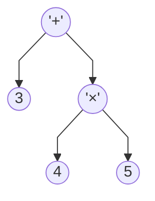
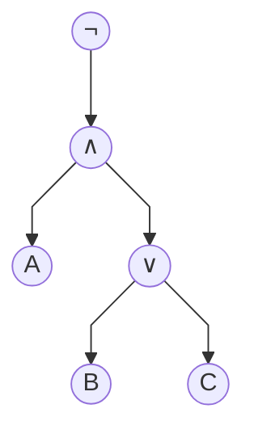
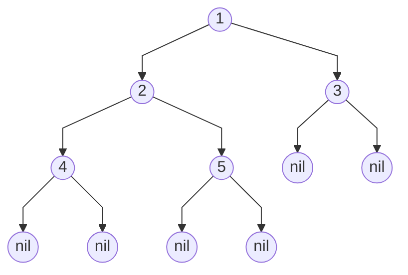
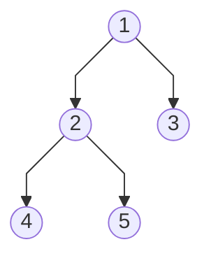
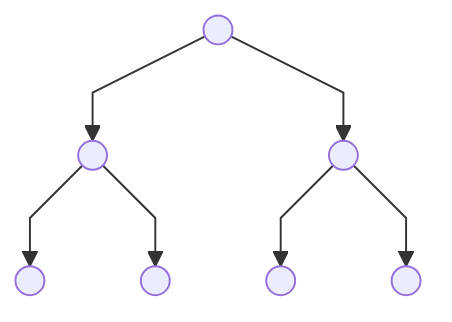
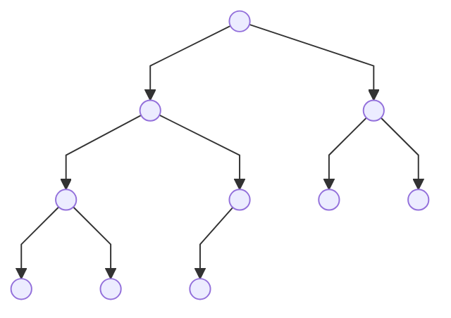
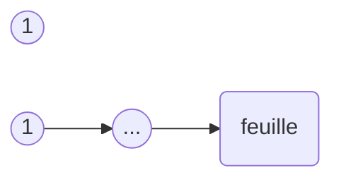
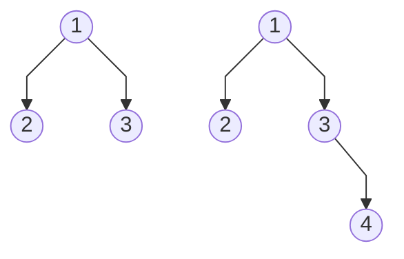
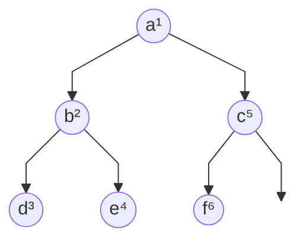

# Les arbres binaires

!!! warning
    Ce cours a été automatiquement traduit des transparents de M.Noyer par Félix qui continue le travail fait par Lorentzo et Elowan et Mehdi, nous ne nous accordons en aucun cas son travail, ce site à pour seul but d'être plus compréhensible pendant les périodes de révision que des diaporamas.

!!!tip "Crédits"

    - "Option informatique MPSI, MP/MP* ", Roger Mansuy, paru chez Vuibert.
    - [Wikipédia](https://fr.wikipedia.org/wiki/Arbre_binaire), arbres binaires
    - Un cours à [Louis Le Grand](https://info-llg.fr/option-mp/pdf/01.arbres.pdf)

## Introduction

### Résumé

"Les arbres permettent la réalisation de structures de données : structure persistante de dictionnaire, structure persistante de file de priorité. Ils permettent aussi de représenter des expressions arithmétiques ou des formules logiques "(programme officiel CPGE 2013).

!!!example ""

    _Figure 1_ – Une arborescence de fichiers

    <p align="center"></p>

    **Commentaire**
    
    La colonne de gauche est l'affichage arborescent de mon répertoire $\texttt{Files}$ à l'aide de la commande $\text{Unix}$ $\texttt{tree Files/}$

    _Figure 2_ – Contenu d'un fichier html

    <p align="center"></p>

    **Commentaire**

    La colonne de gauche est le code d'un fichier $\texttt{html}$. Noter la présentation arborescente de ce langage de balises.

    _Figure 3_ – Affichage html

    <p align="center"></p>

    **Commentaire**

    La colonne de gauche est l'interprétation du fichier précédent par $\texttt{Firefox}$.

### Arithmétique

_Figure 4_ – Une expression arithmétique



**Commentaire**

La colonne de gauche est la représentation arborescente de $3 + 4 ×5$

### Logique

_Figure 5_ – Une expression logique



**Commentaire**

La colonne de gauche est la représentation arborescente de $¬(A ∧(B ∨C )$ soit "$\text{Non}$ ($A$ $\text{et}$ ($B$ $\text{ou}$ $C$)) "

## Définition mathématique

### Arbre binaire

!!!note "Définition $1$ : Arbre binaire"

    Soient $E$ un ensemble de cardinal au moins un ; **nil** un élément d'un  ensemble sans intersection avec $E$ ; $C$ un symbole de constructeur ternaire sans intersection avec les précédents. On définit inductivement les _arbres binaires étiquetés_ par $E$ en convenant que :
    
    - $\color{blue}\text{Règle de base}$ : **nil** est un arbre binaire appelé arbre vide
    - $\color{blue}\text{Règle d'induction}$ : Si $x ∈E$ et si $F_g$ ,$F_d$ sont deux arbres binaires étiquetés par $E$ , alors $A = C (F_g ,x ,F_d )$ est un arbre binaire étiqueté par $E$ .
    - $\color{blue}\text{Règle de complétude}$ : Seuls **nil** et les éléments que l'on peut former en un nombre fini d'application des règles d'induction sont des arbres binaires.

!!!tip "Remarque"

    Un arbre est donc un élément d'un ensemble inductif (voir chapitre précédent). On fait le choix dans la suite de ne pas utiliser de symbole pour le constructeur ternaire : on écrira $(F_g ,x ,F_d )$ plutôt que $C (F_g ,x ,F_d )$. La raison est purement esthétique : cela alourdirait les transparents.

### Vocabulaire

Avec les conventions de la définition $\color{blue}1$ :

!!!quote "Étiquette"

    $x$ est appelée _étiquette_ de la racine de $A$,

!!!quote "Fils gauche / droit"

    Si $A = (F_g ,x ,F_d )$, on dit que $F_g$ est le _fils gauche_ de $A$, et $F_d$ son _fils droit_. Ce sont des _sous-termes immédiats_ de $A$.

!!!quote "Père"

    On dit que $A$ est le _père_ de $F_g$ . On dit parfois $\underline{\text{improprement}}$ que $x$ est le père de $F_g$ .

!!!quote "Feuille"

    Si $Fg = Fd =$ **nil** on dit que $A$ est un _arbre-feuille_ ou plus simplement une _feuille_.

!!!warning ""

    $\color{red}\text{Pour certains auteurs, les feuilles sont les nils !!}$

!!!tip "Remarque"

    Si $A = $(**nil**,$x$ ,$F_d$ ), nous disons que $A$ a un seul fils

!!!quote "Chemin"

    Si $A$ est un arbre, on appelle _chemin_ tout $n$-uplet ($n > 0$) $A = A_0,...,A_n$ tel que $A_0 = A$ et quel que soit $k < n, A_{k +1}$ est un fils de $A_k$ . Le nombre $n$ est la _longueur du chemin_. Parfois, pour désigner un chemin, on ne donne que les étiquettes.

!!!quote "Sous-arbre"

    Dans un chemin, tous les $A_i$ avec $i > 0$ sont appelés des _descendants_ de $A$. On dit aussi _sous-arbre_ ou _sous-termes_.

!!!quote "Noeud interne"

    Un _nœud interne_ possède au moins un fils qui n'est pas l'arbre vide. Ce sont tous les nœuds d'un arbre à l'exception de **nil** et des feuilles.

### Convention de représentation

Par convention, on ne représente ni **nil**, ni les arcs d'extrêmités **nil**. Au lieu de

_Figure 6_ – Avec **nil**



On représente

_Figure 7_ – Sans **nil**



### Propriétés

!!!warning "Lemme"

    Dans un arbre, aucun chemin ne comporte deux fois un même arbre non vide.

!!!note "Preuve"

    - Soit un chemin $A_1,...,A_i ,...,A_j ,...,A_k$ tel que $A_i = A_j$ .
    - Par application du théorème sur l'ordre structurel (voir chapitre [induction](https://mp2i-thiers.github.io/Arbres/induction_structurelle/)), les tailles _structurelles_ (nombres de constructeurs) sont strictement décroissantes.

Ainsi $|Ai |> |Aj |$ et $A_i = A_j$ : **ABSURDE**.

### Types d'arbres binaires

- Certains arbres ne sont pas binaires. Exemple : la figure $\color{blue}1$.
- Un _arbre binaire entier_ est un arbre dont tous les nœuds possèdent zéro ou deux fils (ex : la figure $\color{blue}4$ mais pas $\color{blue}5$).
- Un _arbre binaire parfait_ est un arbre binaire entier dans lequel toutes les feuilles sont à la même distance de la racine (c'est-à-dire à la même profondeur) (ex : la figure $\color{blue}7$).
- L'arbre binaire parfait est parfois nommé arbre binaire _complet_. Cependant certains auteurs$^\textbf{1.}$ définissent un arbre binaire complet comme étant un arbre binaire entier dans lequel les feuilles ont pour profondeur soit $n$ soit $n −1$ pour un $n$ donné (voir figure $\color{blue}8$).

!!!tip ""

    $\textbf{1.}$ Et nous avec !

### Arbres binaires

_Figure 8_ – Un arbre binaire parfait



Tous les niveaux sont remplis.

_Figure 9_ – Un arbre binaire complet gauche



Tous les niveaux sont complets sauf le dernier qui est rempli incomplètement en commençant par la gauche.

## Preuve par induction

### Ordre sur les arbres binaires

!!!quote "$\prec$"

    La relation binaire $\prec$ sur les arbres étiquetés par $E$ définie par 
    
    $A \preceq B \Leftrightarrow$ $A$ est un descendant de $B$
    
    C'est un ordre bien fondé et $\prec$ est un ordre strict.

!!!note "Démonstration"

    Un descendant est un sous-terme. Donc cet ordre n'est rien d'autre que l'ordre structurel (voir chapitre [induction](https://mp2i-thiers.github.io/Arbres/induction_structurelle/)) lequel est bien fondé.

### Eléments sans prédecesseur de ${\displaystyle {\mathcal {A}}}$

!!!waring "Proposition"

    L'ensemble des éléments sans prédecesseur des arbres étiquetés par $E$ est réduit à **nil**.

!!!note "Preuve"

Soit un arbre A.

- Si $A =$ **nil**, il n'a pas de prédécesseur car le constructeur est d'arité $0$.
- Sinon, $A$ est de la forme ($F_g ,x ,F_d$ ) et donc $F_g ≺A$. Donc $A$ admet un prédécesseur.

### Principe d'induction appliqué aux arbres

Soit $P$ un prédicat sur ${\displaystyle {\mathcal {A}}}$

- On établit la propriété pour les éléments minimaux (donc $\{$**nil**$\}$).
- On prend $A$ avec prédécesseur. On suppose que pour tout prédécesseur $B$ de $A$, $P (B )$ est vrai, et on tente d'établir que $P(A)$ est vrai.

## Fonction inductives

Soit ${\displaystyle {\mathcal {A}}}$, l'ensemble des arbres étiquetés par $E$. De nombreuses fonction $f : {\displaystyle {\mathcal {A}}}→F$ se définissent par la donnée d'un élément $a \in F$ et d'une application $φ : F ×E ×F →F$ telles que :

- $f (\textbf{nil}) = a$
- $∀(F_g ,F_d ) ∈{\displaystyle {\mathcal {A}}}^2, ∀x ∈E ,f (F_g ,x ,F_d ) = φ(f (F_g ),x ,f (F_d ))$

Le principe d'induction établit que $f$ est définie sur ${\displaystyle {\mathcal {A}}}$ et qu'elle prend ses valeurs dans $F$ .

### Taille

!!!quote "Taille"

    La _taille_ d'un arbre binaire est le nombre de ses nœuds qui ne sont pas **nil**

    La _taille_ d'un arbre $A$, notée $|A|$, se définie inductivement par :

    - $|\textbf{nil}|= 0$
    - $∀(F_g ,F_d ) ∈{\displaystyle {\mathcal {A}}}^2,∀x ∈E ,|(F_g ,x ,F_d )|= 1 + |F_g |+ |F_d |$

!!!tip "Remarque"

    Cette définition est différente de la taille structurelle vue au chapitre [induction](https://mp2i-thiers.github.io/Arbres/induction_structurelle/) en ce sens qu'elle ne compte pas les constructeurs d'arité $0$. La définition varie selon les auteurs : il faut donc bien lire l'énoncé.

### Profondeur

!!!quote "Hauteur"

    La _hauteur_ d'un arbre binaire est la longueur de la plus longue branche (sans arriver jusqu'à **nil**).

    La _hauteur_ d'un arbre binaire $A$, notée $h(A)$, est la fonction définie inductivement par :

    - $h(nil) = −1$
    - $∀(F_g ,F_d ) ∈\displaystyle {\mathcal {A}}^2,∀x ∈E ,h((F_g ,x ,F_d )) = 1 + max(h(F_g ),h(F_d ))$

!!!quote "Profondeur"

    La _profondeur_ d'un nœud dans un arbre binaire est la longueur du chemin qui le relie à la racine.

!!!tip "Remarque"

    Là encore, la définition varie selon les auteurs.

### Un type $\text{OCAML}$ pour les arbres binaires

```OCaml linenums="1"
(* type possible pour les arbres binaires *)
type 'a arbre =
    Nil | Node of ('a arbre * 'a * 'a arbre);;

let a = let b = Node (Nil , 1, Nil) and c =
Node (Nil , 2, Nil) and d = Node (Nil , 4, Nil) in
let g = Node (b,4,c) and f= Node (Nil , 5, Node(d,3,Nil))
in Node(g,6,f);;(* un arbre à représenter *)
```

### Hauteur et taille

```OCaml linenums="1"
let rec taille a =
    match a with
    | Nil -> 0
    | Node(g,_,d) ->1+taille g+taille d;;

let rec hauteur a =
    match a with
    | Nil -> -1
    | Node(g,_,d) ->1+ (max (hauteur g) (hauteur d));;
```

- On observe d'abord que pour ces fonctions, la complexité au pire est croissante avec la taille de la variable.
- En effet, soit $A$ un arbre avec $n$ nœuds qui atteint le maximum de complexité. Pour ($A$,$x$ ,**nil**), qui a $n + 1$ nœuds, le calcul nécessite au moins une opération de plus (ne serait-ce que le filtrage).

### Complexité du calcul de la hauteur

#### Méthode informelle

Pour un arbre de taille $n$ :

- De façon empirique on peut dire que chaque nœud est parcouru trois fois : quand on y accède (au moment du filtrage), quand le parcours revient du fils gauche (avec l'info sur sa hauteur), quand il revient du fils droit (avec l'info sur sa hauteur).
- Pour chacun de ces trois passages dans le nœud, le nombre d'opérations élémentaires hors appels récursifs est borné par une constante (disons $c$).
- Au total, on peut donc majorer le nombre d'opérations par $3nc$ et le minorer par $n$.
- Donc complexité en $Θ(n)$

### Relation entre taille et hauteur

!!!warning "Proposition"

    Soit $A$ un arbre. Alors $h(A) + 1 ≤|A|≤2^{h(A)+1} −1$. Et les bornes sont atteintes.

!!!note "Preuve par induction"

    - Si $A =$ **nil**, alors $|A|= 0$; $h(A) = −1. −1 + 1 ≤0 ≤2^{−1+1} −1.$ OK
    - Si $A = (G ,x ,D )$, et si la propriété est vraie pour $G$ ,$D$ , alors
    
    $|A|= 1 + |G |+ |D |≥ 1 + h(G ) + 1 + h(D ) + 1 ≥1 + (1 + max(h(G ),h(D ))) = 1 + h(A)$

    Et $|A|= 1 + |G |+ |D |≤1 + 2^{h(G )+1} −1 + 2^{h(D)+1} −1$

    Donc $|A| ≤−1 + 2 ·2^{max(h(G ),h(D))+1} = 2 ·2^{h(A)} −1 = 2^{h(A)+1} −1$
    
    Les deux bornes sont atteintes : à gauche par les listes chaînées et à droite par les arbres parfaits.

## Profondeur moyenne et applications

### Profondeur moyenne

La _profondeur moyenne_ d'un arbre est la moyenne des longueurs de ses branches ou encore la moyenne des profondeurs des feuilles.

!!!warning "Proposition"

    Dans un arbre binaire à $n > 0$ feuilles, la profondeur moyenne est égale ou supérieure à $log_2(n)$

#### Cas de base

Par récurrence sur le nombre de feuille $n$ de $A$, on montre que la profondeur moyenne $m_A$ est plus grande que $log_2(n)$.

- Vrai pour $n = 1$ (profondeur au moins zéro, $log_2 (1) = 0$).



- Si $n = 2$, la plus petite profondeur moyenne intervient quand les deux feuilles sont à la profondeur $1$. Alors la profondeur moyenne vaut $1$ et $log_2 (2) = 1$. Si l'une des feuilles n'est pas à la profondeur $1$, la profondeur moyenne est strictement supérieure à $log_2 (2)$.



#### Cas d'un fils unique

Par récurrence sur le nombre de feuille $n$ de $A$, on montre que la profondeur moyenne $m_A$ est plus grande que $log_2(n)$. Supposons la propriété vraie pour tout arbre binaire d'au plus $n$ feuilles $(2 ≤n)$. On se donne un arbre $A$ de $n + 1$ feuilles $(n ≥2)$. Si $A$ n'a qu'un fils, on se ramène au problème à deux fils :

- L'unique fils $F$ de $A$ a autant de feuilles que $A$ mais la profondeur de ses feuilles est plus petite (car $m_A = m_F + 1$).
- En descendant dans l'arbre on finit par trouver un premier descendant $D$ qui a deux fils (car $A$ a au moins deux feuilles) et $n + 1$ feuilles.
- On montre donc la propriété pour $D$ , elle sera vraie pour $A$ car la profondeur moyenne y est plus grande.

#### Deux fils et $n+1$ feuilles

On suppose que $A$ a deux fils $F_g ,F_d$ . Soit $k$ tel que $F_g$ possède $k$ feuilles $(n + 1 > k ≥1)$, $F_d$ en a $n + 1 −k$

Relation moyenne $/$ somme des profondeurs :

On a à gauche : $\frac{\sum_{i =1}^k{ p^g_i}}{k} = m_g$

!!!note "Notation"

    - $p^g_i$ = profondeur de la feuille i du fils gauche, 
    - $m_g$ moyenne des profondeurs à gauche.

Gauche : $\sum_{i =1}^k{ p^g_i} = k \times \underbrace{m_g}_{\text{prof. moy.}} \underbrace{≥}_{\text{par HR}} k \times log_2(k)$

Droite :

$\sum^{n+1−k}_{i =1} {p^d_i} = (n + 1 −k )\times m_d ≥ (n + 1 −k )\times log_2(n + 1 −k )$.

La somme des profondeurs des feuilles dans $A$ vérifie

$\begin{matrix}
 S_{n+1}& =  & \sum_{r=1}^{n+1}p_r\\
 & & \\
 & = & \sum_{i=1}^{k}{(1 + p_i^g)} + \sum_{i=1}^{n+1-k}{(1+p_i^d)}\\
 & & \\
 & = & n+1+\sum_{i=1}^k{p_i^g}+\sum_{i=1}^{n+1-k}{p_i^d}\\
 & & \\
 & ≥ & n+1+k\times log_2(k) + (n+1-k) \times log_2(n+1-k)
\end{matrix}$

La somme $S_{n+1}$ des profondeurs est :

$S_{n+1} ≥n + 1 + k \times log_2 (k) + (n + 1 −k )\times log_2(n + 1 −k)$

La fonction $f : k \mapsto k \times log_2(k) + (n + 1 −k ) log_2(n + 1 −k )$ se dérive en $f' : k \mapsto log_2(k) − log_2(n + 1 −k )$.

Cette dérivée s'annule en $n+1$ $f′(1) < 0, f′(n) > 0$ donc $f(\frac{n+1}{2})$ est minimale.

Par suite $f (k) = k\times log_2 (k) + (n + 1 −k )\times log_2(n + 1 −k )$ 

Donc $f(k) ≥ f(\frac{n + 1}{2}) = (n + 1)\times log_2(\frac{n + 1}{2})$

Alors la moyenne $m_A = \frac{Sn+1}{n + 1}$ des profondeurs vérifie

$\begin{matrix}
(n + 1) \times m_A &=& \sum_{r=1}^{n+1} p_r \\
&& \\
&≥& n + 1 + (n + 1)\times log_2(\frac{n + 1}{2})\\
&& \\
&=& n + 1 + (n + 1)\times log_2(n + 1) −(n + 1) \\
&& \\
&=& (n + 1)\times log_2(n + 1)
\end{matrix}$

Donc $m_A ≥log_2(n + 1)$ : OK !

### Application aux tris

#### Permutation associée à une liste

Considérons un tri $T$ donné (par ex : tri fusion ou tri insertion).

- Considérons une liste (ou un tableau) à $n$ nombres $\color{red}\text{tous distincts}$. La complexité du tri sur cette structure ne dépend pas des valeurs de ces nombres mais de l'ordre initial dans lequel ils sont placés.
- Classer $[12; 50; 3; 28; 46]$ a la même complexité que le classement de
$[2; 5; 1; 3; 4]$ (permutation d'éléments dans J1,nK).
- A une liste $L$ de $n$ nombres distincts à trier, on associe ainsi une
unique permutation $σ ∈S_n$ . Le coût $C (L)$ du tri de $L$ selon l'algorithme $T$ dépend seulement de $σ$ (ordre des éléments) et on le note donc $C (σ)$.

#### Complexité en moyenne

!!!quote "Complexité en moyenne"

    La _complexité en moyenne_ $c (n)$ du tri selon l'algo $T$ des liste de taille $n$ est le coût moyen des permutations associées : 
    
    $c (n) = \frac{1}{n!} \sum_{σ∈Sn}{ C (σ)}$.

#### Arbre de décision

!!!quote "Arbre de décision"

    Un _arbre de décision_ est un arbre binaire tel que 
    
    - chaque nœud interne est étiqueté avec une comparaison, 
    - chaque feuille est étiquetée avec une permutation

A un algorithme de tri appliqué à des listes de taille $n$ on associe un arbre binaire de décision unique (admis). Une permutation donnée est l'extrémité d'une branche complète de l'arbre.

On construit ainsi cet arbre de décision : La racine est la première comparaison observée entre éléments. Son fils gauche est la première comparaison effectuée lorsque le test correspondant à la racine est positif, le droit est la première comparaison effectuée si le premier test est négatif etc.

L'arbre de décision associé à un tri par comparaison sur des structures
de longueur $n$ est unique (c'est une affirmation, pas une preuve : il
faudrait le montrer) et il a $n!$ feuilles (autant que de permutations).

!!!example ""

    Arbre de décision du tri par insertion pour les listes $[A; B ; C ]$

    ``` mermaid
    %%{ init: { 'flowchart': { 'curve': 'linear' } } }%%
    graph TB; 
        A((A < B))-- oui [A;B;C] -->B((B < C))
        A-- non [B;A;C] -->C((A < C))
        C-- oui -->D((BAC))
        C-- non [B;C;A] -->E((B < C))
        E-- oui -->F((BCA))
        E-- non -->G((CBA))
        B-- oui -->H((ABC))
        B-- non [A;C;B] -->I((A < C))
        I-- oui -->J((ACB))
        I-- non -->K((CAB))
    ```

#### Complexité en moyenne à partir de l'arbre de décision

Soit un tri $T$ et son arbre de décision $A$.

- La complexité du tri par $T$ d'une liste $L$ de longueur $n$ est proportionnelle à la longueur de la branche de A empruntée en traitant L. $\color{red}\text{Si }L\text{ est associée à la permutation σ, la feuille sur laquelle arrive}$ $\color{red}\text{ l'algorithme en traitant }L\text{ est la permutation réciproque σ−1 (car} σ ◦σ^{−1} = id_{S_n})$

!!!example ""

    Si $L$ est associe à la permutation $[2,3,1]$ on arrive sur la feuille **CAB** qui correspond à la permutation $[3,1,2]$ réciproque de la précédente.

- La complexité en moyenne de $T$ est donc proportionnelle à la profondeur moyenne des $n!$ feuilles.
- Or, celle-ci est minorée par $log_2(n!)$ Et la formule de Stirling nous donne $log_2(n!) = Θ(n \times log(n))$.
- Ainsi, la meilleure complexité possible en moyenne pour un tri par comparaison est $Θ(n \times log (n))$.
- La complexité au pire est supérieure à la complexité en moyenne. Un algorithme qui, comme le tri fusion, réalise une complexité au pire en $Θ(n\times log (n))$ est donc un algorithme de tri par comparaison optimal.

## Parcours d'arbres binaires

### Objectif

Un _parcours d'arbre_ est une façon d'ordonner les nœuds d'un arbre afin de tous les parcourir.

On peut le voir comme une fonction qui à un arbre associe une liste de ses nœuds même si la liste n'est souvent pas explicitement construite par le parcours.

### Parcours en profondeur

#### Depth-first search (DFS)

Les _parcours en profondeur_ se définissent de manière récursive sur les arbres. Le parcours d'un arbre consiste à traiter la racine de l'arbre et à parcourir récursivement les sous-arbres gauche et droit de la racine. Les parcours _préfixe_, _infixe_ et _suffixe_ se distinguent par l'ordre dans lequel sont faits ces trois traitements.

_Figure_ – Ordre dans lequel les nœuds sont visités (en exposant) dans un parcours en profondeur préfixe. Les lettres correspondent à la numérotation par parcours en largeur.



#### Type OCAML (rappel)

Il y a beaucoup de façon de définir les arbres binaires en Ocaml. En voici une :

```OCaml linenums="1"
type 'a tree = Nil | Node of 'a tree * 'a * 'a tree;;

let t = let g = Node(Node(Nil ,3,Nil),2,Node(Nil ,4,Nil)) and
    d = Node(Node(Nil ,6,Nil),5,Node(Nil ,7,Nil)) in
    Node(g,1,d);;
```

#### Parcours préfixe

!!!note "Principe"

    Dès qu'on passe par un nœud, on effectue un traitement de son étiquette. On n'attend pas que les descendants du nœud soient traités. On fait ce qu'on a à faire avec ce nœud dès qu'on passe dessus.

```OCaml linenums="1"
let rec parcours_prefixe = function
    | Nil -> ()
    | Node (g, r, d) ->
        Printf.printf "%d " r;
        parcours_prefixe g;
        parcours_prefixe d ;;

parcours_prefixe a;;
```

On obtient **1 2 3 4 3 6 7**.

#### Parcours suffixe

!!!note "Principe"

    Quand on passe sur un nœud, on attend que tous ses descendants soient traités avant d'agir sur ce nœud.

```OCaml linenums="1"
let rec parcours_suffixe = function
    | Nil -> ()
    | Node (g, r, d) ->
        parcours_suffixe g;
        parcours_suffixe d ;
        Printf.printf "%d " r;;

parcours_suffixe a;;
```

On obtient **3 4 2 6 7 5 1**

#### Parcours infixe

!!!note "Principe"

    Quand on passe sur un nœud, on traite d'abord le fils gauche. Puis on traite le nœud lui même. Et enfin on traite le second fils.

```OCaml linenums="1"
let rec parcours_infixe = function
    | Nil -> ()
    | Node (g, r, d) ->
        parcours_infixe g;
        Printf.printf "%d " r;;
        parcours_infixe d ;;


parcours_infixe a;;
```

On obtient **3 2 4 1 6 5 7**

#### Compléments

La complexité du parcours en profondeur pour un arbre a déjà été étudiée : c'est celle du calcul de la hauteur (laquelle est un parcours suffixe dans notre code puisque le traitement a lieu lorsqu'on connaît la hauteur des $2$ fils) : $Θ(n)$

Le parcours préfixe (resp. suffixe) est injectif (si l'on considère que
**Node(Nil,x,f)=Node(f,x,Nil)**). Voir TD.

### Parcours en largeur

#### BFS

L'algorithme de _parcours en largeur_ (ou BFS, pour Breadth First Search en anglais) permet le parcours d'un arbre de la manière suivante : on commence par explorer un nœud source, puis tous ses fils, puis les fils des fils, etc.

En bref, on visite complètement une génération avant de visiter la génération suivante.

!!!example "Un BFS"

    La dénomination des nœuds suivants respecte le parcours en largeur :

    ``` mermaid
    %%{ init: { 'flowchart': { 'curve': 'linear'} } }%%
    graph TB;
    A((a)) --> B((b))
    A --> C((c))
    B --> D((d))
    B --> E((e))
    C --> F((f))
    C --> G((g))
    D --> H((h))
    ```

!!!example "BFS vs DFS"

    La dénomination des nœuds suivants respecte le parcours en profondeur (prefixe) :

    ``` mermaid
    %%{ init: { 'flowchart': { 'curve': 'linear'} } }%%
    graph TB;
    A((a)) --> B((b))
    A --> C((f))
    B --> D((c))
    B --> E((e))
    C --> F((g))
    C --> G((h))
    D --> H((d))
    ```

#### Deux fonctions auxiliaires

Liste des étiquettes des racines d'une forêt (i.e. un ens. d'arbres) :

```OCaml linenums="1"
let rec label_list f = match f with
    | [] -> []
    | Nil::q->label_list q
    | Node(_,x,_)::q->x::( label_list q);;
```

Liste des fils des racines d'une forêt (si ce sont des nœuds internes).

```OCaml linenums="1"
let rec sons f = match f with
    | [] -> []
    | Nil::q -> sons q
    | Node(Nil ,_,Nil)::q->sons q
    | Node(Nil ,_,d)::q-> d::( sons q)
    | Node(g,_,Nil)::q-> g::( sons q)
    | Node(g,_,d)::q-> g::(d::( sons q));;
```

#### Principe du parcours en largeur

La fonction **sons** retourne une forêt, **label_list** retourne la liste des étiquettes de la forêt.

La fonction **bfs** utilise la fonction aux qui prend une forêt et concatène la liste de ses étiquettes avec la liste des étiquettes des fils des racines.

```OCaml linenums="1" title="bfs"
let bfs t =
    let rec aux les_t = match les_t with
        | [] -> []
        | _ -> (label_list les_t) @ (aux (sons les_t))
    in aux [t];;
```

Complexité : chaque étiquette est ajoutée une fois et une seule à la liste résultat, $\text{on a envie de dire que la complexité est en }Θ(n)$.

Dans ce qui suit on note $u_p$ la complexité pour calculer la liste des étiquettes de l'arbre à la profondeur $p$. Il s'agit de calculer $u_0$.

#### Complexité du parcours en largeur

Pour un arbre à $n$ nœuds de hauteur $h$ :

- La fonction qui récupére les étiquettes des racines d'une forêt $F$ et celle qui récupère les fils sont de complexité $Θ(|F |)$.
- A chaque étape, on récupère la liste des étiquettes des sous-arbres d'une même profondeur et on l'ajoute au résultat.
- Lorsqu'on traite la liste des nœuds de profondeurs $p$ (disons qu'il y en a $n_p$ ) :
    - on récupère la liste de leurs étiquettes en $O (n_p )$ ;
    - on les concatènes à gauche du résultat de l'appel récursif en $O (n_p )$ ;
    - la liste des fils des nœuds de profondeur $p$ s'obtient aussi en $O (n_p )$.
    - A ceci s'ajoute le coût de l'appel interne.
- La complexité $u_p$ vérifie donc une relation de la forme : $u_p = n_p + u_{p+1}$. $\color{red}\text{Donc }u_p −u_{p+1} = n_p$.
- Au départ $u_0 −u_1 = 1$ (nombre de nœuds à la profondeur $0$ : racine) et $u_h −u_{h+1} = n_h$ avec $h$ la hauteur et $u_{h+1}$ qui correspond au traitement de la liste vide (pas de nœud à la profondeur $h + 1$).
- On somme sur les profondeurs allant de $0$ (la racine) à $h$ (la hauteur de l'arbre). C'est une série telescopique. On obtient : 

$u_0 - \underbrace{u_{h+1}}_{\text{exploration liste vide}} = \sum_{p=0}^h{n_p} = Θ(n)$

La complexité est proportionnelle au nombre de nœuds : on aurait pu s'en douter !
