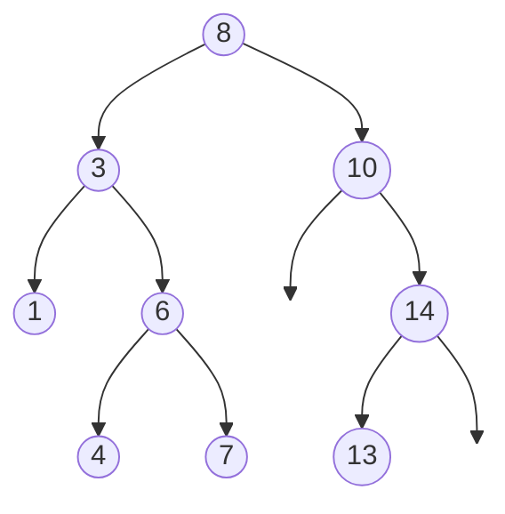
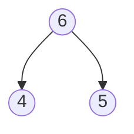
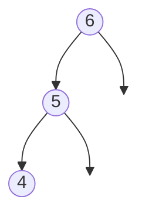
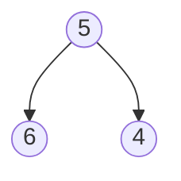
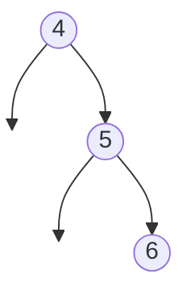
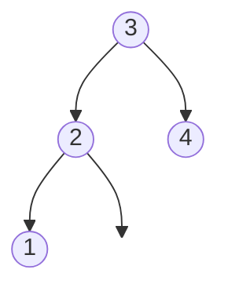
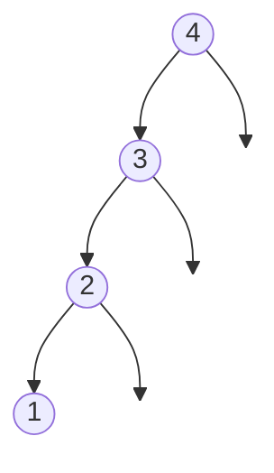

# Arbre Binaire de Recherche

!!! warning 
    Ce cours a été automatiquement traduit des transparents de M.Noyer par
    Lorentzo et Elowan et mis en forme par Mehdi, nous ne nous accordons en aucun cas son travail, ce
    site à pour seul but d’être plus compréhensible pendant les périodes de
    révision que des diaporamas.

!!! tip "Crédits"
    - "Option informatique MPSI, MP/MP*", Roger Mansuy, paru chez Vuibert.
    - Wikipédia : Tas, Tas binaires, Tri par tas
    - OpenClassRoom Arbres binaires de recherche

!!! quote "Définition: Arbre binaire de recherche"
    Binary search trees (BST)
    
    Un arbre binaire de recherche (ABR) sur un type totalement ordonné est
    un arbre binaire tel que pour tout nœud interne, les étiquettes
    apparaissant dans le sous-arbre gauche (resp.droit) sont strictement¹
    inférieures (resp. supérieures) à celle la racine.
    1. Selon la mise en œuvre de l’ABR, on pourra interdire ou non des clés de valeur égale.

_Figure – Un ABR_



Les étiquettes de gauche ont des valeurs plus petites que
celle de la racine, celle de droite sont plus grandes

## Arbre binaire de recherche

### DSF
On peut facilement récupérer les clés d’un arbre binaire de recherche dans
l’ordre croissant en réalisant un parcours en profondeur infixe. Contre exemple:

_Figure – Un arbre binaire qui n’est pas un ABR_


_Figure – Un ABR pour représenter_ ```[4,5,6]```

_Figure – Un ABR équilibré pour représenter_ ```[4,5,6]```

_Figure – Un ABR pour représenter_ ```[4,5,6]```



Passage liste ordonnée/ABR
A une liste ordonnée correspondent plusieurs ABR.

### Type de données
Nous utiliserons le type suivant:

``` Ocaml linenums="1" title="Type Arbre"
--8<-- "Type Arbre"

type 'a tree =
    |Nil
    |N of 'a * 'a tree * 'a tree;;
```
!!! note ""
    * Une feuille est implémentée par ```N(x, Nil, Nil)```,
    * une nœud d’arité 1 par ```N(x, t, Nil)``` ou ```N(x, Nil, t)``` avec x et t de type
    convenable.
    * Une telle structure modélise les arbres binaires, pas seulement les ABR.
    C’est lors de la création d’un arbre que nous ferons attention à ce qu’il
    respecte la contrainte d’ordre.

###     Primitives
!!! note ""
    * Une fonction de création d’un ABR à partir d’une liste.
    * Une fonction d’insertion d’une valeur dans un ABR.
    * Une fonction de recherche d’une valeur dans un arbre.
    * Une fonction de suppression d’une valeur dans un arbre.

``` Ocaml linenums="1" title="Insérer sous une feuille"
--8<-- "Insérer sous une feuille"

let rec insert x t = match t with
    | Nil -> N (x , Nil , Nil )
    | N (y ,g , d ) when x < y -> N (y , insert x g , d )
    | N (y , g , d ) when x >y -> N (y ,g , insert x d )
    | _ -> t (* pas de doublon *) ;; (* le laisser sinon Warning 8. *)
```
!!! note ""
    * Le choix qui est fait ici est celui d’un ABR sans étiquettes de mêmes valeurs (pas de doublon).
    * On insère la nouvelle valeur sous une feuille.
    * On pourrait aussi insérer x à la racine:
        * "Couper" l’arbre en deux sous-ABR g , d contenant respectivement les éléments plus petits et plus grands que x.
        * construire l’arbre ```N(x, g, d)```

### Complexité de l’insertion sous une feuille
Description informelle pour un arbre de hauteur $h$ à $n$ nœuds.

!!! note ""
    * On descend le long d’une branche jusqu’à la feuille.
    * Il y a $O(h)$ pour cette descente. Pour chaque nœud interne, les opérations hors appel récursif sont à coût constant.
    * Dans le cas d’arrêt, le coût est également constant.
    * Donc complexité en $O(h)$.
    * On comprend l’intérêt de "contrôler" $h$. En pratique, on essaye de conserver $h \leq C \log(n)$ pour une certaine constante. Si on arrive à maintenir cette contrainte au fil des insertions, on obtient un arbre équilibré.

### Création
``` Ocaml linenums="1" title="Créer un ABR à partir d’une liste "
--8<-- "Créer un ABR à partir d’une liste "

let rec create l = match l with
    | [] -> Nil
    | e :: q -> insert e ( create q ) ;;

(*test*)
create ([1;4;2;3]) ;;
```

Figure – ABR obtenu par ```create([1;4;2;3]);;```



### Liste triée
Si la liste est déjà triée, on obtient une liste chaînée.

Figure – ABR obtenu par ```create([1;4;2;3]);;```


### Complexité de la création

!!! note ""
    * Si la liste est déjà triée, l’ABR n’a qu’une branche.
    * Pour une liste triée de longueur $n$, la complexité vérifie une relation de la forme

    $$ \begin{align}
    c_n &= c_{n−1} + \underbrace{n}_{\text{cpx insertion}} + \underbrace{c}_{\text{autres opération}}  \\
    &= c_{n−2} + 2c + n +  \underbrace{n-1}_{\text{cpx insertion}} \\ 
    &= \text{ ...} \\
    &= c_0 + nc + \sum\limits_{k=1}^{n}k \\
    &= \theta(n²)
    \end{align}$$

    * On voit l’intérêt de maintenir un certain équilibre dans l’arbre au moment
    des insertions.

### Utilité de l’équilibrage des arbres
!!! note ""
    * A priori, cela ne semble pas si grave d’avoir une liste chaînée et non un
    bel arbre binaire "équilibré".
    * Mais les opérations sur les ABR (insertion, suppression, recherche) ont
    une complexité au pire qui dépend de la hauteur...
    * ... d’où l’idée qu’il faut limiter la hauteur des arbres lors de l’insertion.
    * C’est le principe du rééquilibrage des ABR.

### Création d’un arbre équilibré à partir d’une liste

!!! note ""
    * Un arbre A est dit équilibré lorsque $h(A) = O(\log_{}(|A|))$
    * Exemple arbres AVL: pour chaque nœud, la différence entre les hauteurs de ses fils (l’un éventuellement vide) est $0$, $1$ ou $−1$.
    * On peut établir que, dans un AVL de taille ${|A| = n} \implies {\frac{3}{2}\log_{2}(n+ 1) \geq h(A)}$
    (cf TD).
    * Autre exemple : arbres Rouge-Noir (cf TD).
    * Dans un arbre équilibré, insérer x se fait en $O(\log_{2}(n))$ appels internes au
    pire plus un nombre borné d’autres opérations en $\Theta(1)$ .
    * Si on maintient le caractère équilibré (le rééquilibrage a un coût
    logarithmique -admis-), le coût de la création à partir d’une liste est donc
    de l’ordre de $\Theta(\sum\limits_{k=1}^{n}\log_{2}(k)) = \Theta(\log_{2}(n!)) = \Theta(n\log_{2}(n))$

### Rechercher
```ocaml linenums="1" linenums="1"
let rec search x t = match t with
(* cherche x dans t *)
| Nil -> false
| N (y ,_ , _ ) when y = x - > true
| N (y ,g , _ ) when x < y -> search x g
| N (y ,_ , d ) when x > y -> search x d
| _ -> false ;; (* le laisser sinon ’ this pattern - matching is not
exhaustive . ’ *)
```

!!! note ""
    * Si x est égal à la racine de t, c’est bon. Sinon on cherche récursivementdans le sous arbre gauche lorsque x es plus petit que la racine, et à droite sinon.
    * Si x est à la profondeur k, il y a k appels internes pour le trouver.
    * Si x n’est pas dans l’arbre, il y a au pire $h(t)$ appels internes.

### Suppression 
#### Opération de fusion
On veut "fusionner" deux ABR G et D tels que les étiquettes de G sont toutes
plus petites que celles de D. Ceci afin d’obtenir un ABR unique construit à partir
des nœuds des deux arbres.

```ocaml linenums="1" linenums="1"
let rec merge a b = match a , b with
(* fusion qui privilégie l ’arbre gauche *)
| Nil , t | t , Nil -> t
| N (x , ga , da ) , N (y , gb , db ) -> (* on a max a <= min b *)
    N (x , ga , N (y , merge da gb , db ) ) ;; 
```
Dans cette fusion, la racine de l’arbre gauche devient systématiquement la
racine de l’arbre retourné. On aurait pu privilégier l’arbre droit.
```ocaml linenums="1" linenums="1"
let a1 = N (3 , N (2 , Nil , Nil ) ,N (4 , Nil , Nil ) ) in 
let a2 = N (30 , N(20 , Nil , Nil ) ,N (40 , Nil , Nil ) ) in
merge a1 a2 ;;

(* Et on obtient : *)
N (3, N (2, Nil, Nil),
    N (30, N (4 , Nil, N (20, Nil, Nil)),
        N (40, Nil, Nil)))
```

<p align="center"></p>
_Figure – En rouge, la fusion des deux arbres bleus_

#### Correction de la fusion
!!! note "Preuve par induction" 
    On montre que si on fusionne deux ABR a, b tels que max
    a ≤ min b, alors le nouvel arbre formé est un ABR contenant toutes les
    étiquettes de a, b.

    * __Cas de base :__ si un des deux arbres est vide, on renvoie l’autre. C’est un
    ABR par hyp. et il contient bien toutes les étiquettes des deux arbres.
    * __Hérédité.__ Soient ```a = N(x, ga, da)``` et ```b = N(y , gb, db)``` non vides avec $\max a \leq \min b$.
        * Notre hypothèse d’induction (HI) est que la fusion d’un sous-terme
        immédiats de a avec un sous-terme immédiat de b est un ABR
        contenant toutes les étiquettes de ses deux sous-termes.
        * La racine du nouvel arbre est x et elle est plus grande que toutes les
        étiquettes de son fils gauche ga (puisque a est un ABR).
        * Le fils droit est ```d = N(y , merge(da, gb), db)```. Par (HI) la fusion
        ```merge(da, gb)``` est un ABR avec toutes les étiquettes de da, gb.
        * Comme y est supérieur aux étiquettes de gb, elles-mêmes plus
        grandes que celles de da, il vient que y est supérieur aux étiquettes
        de l’ABR résultant de la fusion.
        * Or y est inférieur aux étiquettes de db puisque b est un ABR. Donc ```d =
        N(y , merge(da, gb), db)``` est un ABR dont toutes les étiquettes sont aumoins plus grandes que celles de la plus petite de da. De plus il contient y et toutes les étiquettes de da, gb, db.
    * Donc x est plus petit que les étiquettes de d (qui est un ABR) et plus
    grand que celles de ga (qui est un ABR) donc ```N(x, ga, d)``` est un ABR avec
    toutes les étiquettes de a, b.

#### Complexité de la fusion
* Soient deux ABR g , d :
Il y a au plus autant d’appels internes que le minimum de hauteur des sous arbres.
* La complexité est en $\Theta(\min(h(g), h(d)))$ 

```ocaml linenums="1" linenums="1"
let rec remove x t = match t with (* on commence par chercher x dans t *) 
	| Nil -> failwith " x not found " (* on n’a pas trouvé x *) 
	| N (y,g, d) when x < y -> N (y, remove x g, d) 
	| N (y,g, d) when x > y -> N (y, g, remove x d) (* A partir d'ici, on a trouvéx *) 
	| N (y,g, d) when y = x -> merge g d (* fusion des deux sous - arbres *) 
	| _ -> failwith " ne devrait pas arriver ";;
```
!!! tip "Remarques"
    Lorsque le nœud A d’étiquette x n’a qu’un fils, celui-ci prend la place de son
    père (on le "remonte").
    Si A est une feuille, on se contente de la supprimer (la fusion met Empty à la
    place de A).

## Dictionnaire
!!! quote "Définition: Tableau associatif"
    Tableau associatif (aussi appelé dictionnaire ou table d’association) : type
    de données associant à un ensemble de clefs un ensemble correspondant
    de valeurs. Chaque clef est associée à une valeur unique : un dictionnaire
    correspond donc à une application en mathématiques. Il peut être vu
    comme une généralisation du tableau dont les indices ne serait pas
    nécessairement des entiers.

__Opérations usuellement fournies:__

!!! note ""
    * ajout : association d’une nouvelle valeur à une nouvelle clef ;
    * modification : association d’une nouvelle valeur à une ancienne clef ;
    * suppression : suppression d’une clef ;
    * recherche : détermination de la valeur associée à une clef, si elle existe.

    Les dictionnaires peuvent être implémentés concrètement par des ABR. Ce
    sont alors des données persistantes. L’ensemble des clés doit être totalement
    ordonné. Les étiquettes des nœuds de l’ABR sont des couples (clés, valeurs) et
    le placement d’un nœud dans l’arbre est fait selon sa clé et non sur sa valeur.
    En OCAML, explorons 3 façons de définir les dictionnaires.

#### Dictionnaires par liste de paires
Méthode la plus simple. Persistante.

```ocaml linenums="1"
(* dictionnaires par liste de paires *)
let m = [ " Sally Smart ", " 555 -9999 " ;
	 " John Doe ", " 555 -1212 " ;
	 " J.Random Hacker ", " 553 -1337 " ];;
List.assoc " John Doe " m;;
(* # - : string = " 555 -1212 " *)
```
#### Dictionnaires par AVL

!!! note ""
    * Les arbres AVL ont été historiquement les premiers arbres binaires de
    recherche automatiquement équilibrés.
    * Dans un arbre AVL, les hauteurs des deux sous-arbres d’un même nœud
    diffèrent au plus de un.
    * La recherche, l’insertion et la suppression sont toutes en $O(\log_{2}(n))$ dans
    le pire des cas.
    * L’insertion et la suppression nécessitent d’effectuer des rotations
    (opérations de rééquilibrage).

!!!tip ""
    Le nom AVL vient des deux inventeurs Georgii Adelson-Velsky et Evguenii Landis (1962).

```ocaml linenums="1"
(* dictionnaire applicatif réalisé par arbres équilibrés *)
 (* dictionnaire applicatif réalisé par arbres équilibrés *) 
include (Map.Make (String));; 
let m = empty 
	|> add " Sally Smart " " 555 -9999 " 
	|> add " John Doe " " 555 -1212 " 
	|> add " J.Random Hacker " " 553 -1337 ";; 
find " John Doe " m;; 
(* # - : string = "555 -1212" *) 
```
Structure persistante basée sur les arbres équilibrés.
Ajout/Suppression/Recherche en temps logarithmique.

#### Dictionnaires par table de hachage

```ocaml linenums="1"
(* dictionnaires par table de hachage polymorphe *)
let m = Hashtbl.create 3;; (* taille attendue 3 , ç a peut changer *)
Hashtbl.add m " Sally Smart " " 555 -9999 " ;
Hashtbl.add m " John Doe " " 555 -1212 " ;
Hashtbl.add m " J . Random Hacker " " 553 -1337 " ;;
Hashtbl.find m " John Doe " ;;
(* # - : string = "555 -1212" *)
```

Structure impérative. Modifications en place. Ajout/Suppression/Recherche en
temps constant (en moyenne pour ajout, et pour la recherche, ça dépend en
fait de la fonction de hash).

## Tas

!!! quote "Définition: Tas"
    Un tas de hauteur h est un arbre binaire vérifiant :

    * __Condition d’ordre :__ les fils d’un nœud ont une étiquette inférieure ou
    égale à celle du père.
    * __Condition de structure:__ Un tas est complet gauche :
        * Tous les niveaux sont remplis sauf éventuellement le dernier.
        * Le dernier niveau (éventuellement incomplet) est rempli sans trou enpartant de la gauche.

#### Précisions et conséquences

!!! note ""
    * Un arbre du type précédent est dit de type tas-max (racine=max).
    * tas-min : l’étiquette du père est plus petite que celle des fils.
    
    Les branches sont toutes de longueur h ou h − 1, enlever les feuilles de
    profondeur h donne un arbre parfait, les nœuds internes de profondeur h − 1
    d’arité ≥ 1 sont à gauche des feuilles de profondeur h − 1, si il y a un nœud
    interne de profondeur h − 1 avec un seul fils, son fils est une feuille et c’est le
    dernier nœud dans le parcours en largeur.

!!!example "Exemple"
    <p align="center"></p>
    Figure – Un tas. Si on enlève les feuilles de profondeur 2, l’arbre est parfait

Tous les niveaux sont remplies, sauf le dernier, lequel est partiellement rempli en commençant par la gauche. 
!!!example "Contre-exemples"
    Les arbres suivants ne sont pas des tas :
    <p align="center"></p>
    Figure – Un nœud de hauteur h − 1 et d’arité 1 est à gauche d’un nœud de hauteur h − 1 d’arité 2 
    <p align="center"></p>
    Figure – Un père a un fils d’étiquette plus grande que la sienne 

#### Hauteur d’un arbre complet gauche 

Soit A un arbre complet gauche à n nœuds et de hauteur p 

* L’avant dernier niveau (qui correspond à un arbre parfait) est rempli. Et le dernier niveau contient au moins une feuille. 

$$\begin{align}
&2p − 1 < n ≤ \underbrace {2^{p+1} − 1}_\text{taille min. d’un arbre parfait plus gros que A} \\
&\Rightarrow 2p ≤ n < 2^{p+1} &\\
&\Rightarrow p ≤ log_2(n) < p + 1 &\\
&\lfloor \log_2(n) \rfloor  = p\\
\end{align}$$

!!!example "Exemple"
    <p align="center"></p>
    Figure – Un tableau représentant un tas 

!!!example "Contrexemples"
    Les arbres suivants ne sont pas des tas : 
    <p align="center"></p>
    Figure – Un nœud de hauteur h − 1 et d’arité 1 est à gauche d’un nœud de hauteur h − 1 d’arité 2 
    <p align="center"></p>
    Figure – Un père a un fils d’étiquette plus grande que la sienne 

### Tas et tableaux 
On peut stocker un tas dans un tableau dont on n’utilise pas (pour le moment) le premier élément.

* La racine occupe l’élément d’indice 1, 
* Les fils du nœud d’indice k (avec k > 0) sont aux indices 2k et 2k + 1 (si ceux-ci ne dépassent pas la longueur du tableau).
* Le père du nœud d’indice k est à l’indice $\lfloor k/2 \rfloor$.

<p align="center"></p>
Figure – Relations père/fils dans un tableau représentant un tas

#### En CAML 
```ocaml linenums="1"
(* correspond au schéma précédent en OCAML *) 
let t = [|6; 12; 9; 6; 2; 7; 5; 0; 67; 33|];;
```

Lorsqu’on crée un tableau représentant un tas :

* Il faut prévoir la taille du tableau à l’instant initial (6 ici) et les éventuels ajouts à effectuer (en clair prévoir plus de place que la simple taille du tableau à l’instant 0). 
* Le premier élément du tableau désigne la taille du tas (qui est différente de celle du tableau).
* Les éléments 0, 67, 33 en fin de tableau ne sont pas considérés comme appartenant au tas. Ils seront remplacés par les valeurs éventuellement ajoutées au tas.

#### Un problème
Le type de la taille du tas (int) fige le type du tableau avec l’implémentation précédente. Toutes les valeurs du tas doivent être des entiers... 

```ocaml linenums="1"
(* pour dissocier le type de la taille du tas de celui de ses éléments,  on peut utiliser un type enregistrement *) 
type ’a myHeap =
	{ mutable length : int ; heap : ’a array };;
```

### Opérations sur les tas

* Ajouter : ajout d’un élément dans le tas binaire en préservant la structure de tas. 
* Retirer : retirer un élément d’indice donné et rectifier le tableau pour qu’il corresponde de nouveau à un tas. 
* Construire : construction du tas binaire à partir d’un ensemble d’éléments. 

Considérons que l’on veuille ajouter le nœud x à notre tas binaire :
On insère x à la prochaine position libre (la position libre la plus à gauche possible sur le dernier niveau), puis on effectue l’opération suivante (que l’on appelle percolation vers le haut ou percolate-up) pour rétablir si nécessaire la propriété d’ordre du tas binaire : 

* Tant que x n’est pas la racine de l’arbre et que l’étiquette de x est strictement supérieure à celle du père, échanger les positions entre x et son père. 

???example "Exemple"
    On veut ajouter 50 dans un tas-max :
    <p align="center"></p>
    Figure – On cherche le seul emplacement possible pour préserver la structure d’arbre complet gauche

    <p align="center"></p>
    Figure – le nœud d’étiquette 50 est placé provisoirement. On le compare à son père (28) 

    <p align="center"></p>
    Figure – Comme 50 > 28, on échange les positions de 50 et 28. Et on compare 50 avec son nouveau père (41)... 
    
    <p align="center"></p>
    Figure – Comme 50 > 41, on échange les positions de 50 et 41. Et on compare 50 avec son nouveau père (53)... 

    <p align="center"></p>
    Figure – Comme 50 ≤ 53, il n’y a rien à faire : 50 a trouvé sa bonne place 

#### La fonction auxiliaire d’échange

```ocaml linenums="1"
let swap i j t = (*échange deux éléments d’un tableau*) 
	let c = t.(i) in t.(i) <-t.(j) ; t.(j) <-c;; 
```

Complexité en $\Theta(1)$.

#### La fonction auxiliaire de percolation 

```ocaml linenums="1"
let rec percolate_up n t = 
	(* n est l’indice de l’élément à percoler *)
	if n > 1 then 
	    begin (* t .(n) n'est pas la racine *) 
		let m = n /2 (* indice du père *) 
		in if t.(m) < t.(n) then 
		    begin 
		        swap m n t ; (*échange père / fils *) 
		        percolate_up m t ; (* percolate_up avec m *) 
     	    end ;
	end;; 
```

#### Complexité de la percolation 
On applique cette fonction à un tas d’entiers de n nœuds (représenté par un tableau) : Dans le pire des cas, l’élément remonte la branche la plus longue du tas : $\log_2(n)$ étapes puisque le tas est un arbre binaire presque parfait. A chaque étape, il y a un nombre borné c d’opérations élémentaires. Au total, entre $\log_2(n)$ opérations et $c\log_2(n)$. Complexité en $\Theta(\log_2(n))$.

#### La fonction d’insertion

##### Principe

On insère l’élément après le dernier élément du tableau ($\Theta(1)$) et on percole (au pire $\Theta(\log_2(n))$) si n est le nombre de nœud). Donc complexité au pire $\Theta(\log_2(n))$:

```ocaml linenums="1"
let insert v t = 
	t.(0) <- t.(0) +1; (* maj lg du tas *) 
	t.(t.(0)) <- v ; (* placer v à la derni è re place *) 
	percolate_up (t.(0)) t;;
```

<p align="center"></p>
Figure – Le tas-max de référence

### Supprimer un élément 

???example "Schema"
    On souhaite supprimer la racine du tas-max suivant : 
    <p align="center"></p>
    Figure – On remplace la racine par le dernier nœud 
    <p align="center"></p>
    Figure – On compare 20 et son fils max (41). Comme 41 > 20, on échange 41 et 20 

    <p align="center"></p>
    Figure – On compare 20 et son fils max (36). Comme 36 > 20, on échange 36 et 20 
    <p align="center"></p>
    Figure – On compare 20 et son fils max (31). Comme 31 > 20, on échange 31 et 20. On est alors dans un des deux cas d’arrêt : plus de fils ou pas de fils plus grand. Ici, 20 n’a plus de fils. On a fini. 

#### Principe

On veut supprimer la racine. Lorsqu’on supprime le dernier nœud d’un tas, celui-ci reste un tas. On supprime le dernier nœud et on le met à la place du nœud racine (la propriété d’ordre est perdue). On percole vers le bas (percolate-down) pour retrouver la propriété d’ordre. 

#### Recherche du plus grand fils

```ocaml linenums="1"
let aux_max n t = (* cette fonction retourne l’indice du fils le plus grand de t .(n) ; -1 si pas de fils *) 
	if 2 * n < t.(0) then 
		begin (* t .(n) a deux fils *) 
			if t.(2* n) < t.(2* n +1) then 2* n +1 
			else 2* n 
		end 
	else (* moins de deux fils *) 
		begin 
			if 2 * n = t.(0) then 2 * n (* un seul fils *) 
			else -1 (* pas de fils *) 
		end;; 
```

Complexité en $O(1)$.

#### Percolate-down 

```ocaml linenums="1"
let rec percolate_down k t = 
	let m = aux_max k t (* m vaut -1,2 k ou 2 k +1 *) in 
		if m > -1 && t.(m) > t.(k) then
			(* rqe : si m = -1 ou t .(m) <= t .(k) on ne fait rien *) 
			begin 
				swap k m t ; 
				percolate_down m t ; 10 
			end;; 
```

#### Complexité de la percolation

A chaque appel interne on descend d’un étage dans l’arbre. Le nombre d’appel est majoré par la hauteur ( $\log_2(n)$ pour n nœuds dans cet arbre complet gauche). A chaque appel interne, il y a moins de c opérations élémentaires. Coût total entre $\log_2(n)$ et $c\log_2(n)$. ODG $\Theta(\log_2(n))$

#### Supprimer la racine

```ocaml linenums="1"
let remove t = 
	(* mettre dernier elt dans t .(1) : *) 
	t.(1) <- t.(t.(0)) ;
	 (* chger taille du tas : *) 
	t.(0) <- t.(0) - 1; 
	percolate_down 1 t;; 
```

Complexité : la même que la percolation. 

### Création

#### Par remontée : percolation haute du nœud courant

* Pour t, tableau de taille n, on fait une copie de taille assez grande, disons n+1 :
$$
\begin{array}{|c|c|c|}
6 & 12 & 8 & 7 & 15 & → & \color{red}{5} & 6 & 12 & 8 & 7 & 15 \\
\end{array}
$$
Et on maintient "t[1:k+1] est un tas" (notation slicing Python). 

* k = 1 :
$$
\begin{array}{|c|c|c|}
5
& \color{red}6
& 12
& 8
& 7
& 15
\end{array}
$$
t[1:2] est un tas

* k = 2 :  
\begin{array}{|c|c|c|}
5
& \color{red}6
& \color{red}12
& 8
& 7
& 15
\end{array}
On percole up 12.
\begin{array}{|c|c|c|}
5
& \color{red}12
& 6
& \color{red}8
& 7
& 15
\end{array}
t[1:3] est un tas. 

* k = 3 : 8 est à sa place. t[1:4] est un tas.

* k = 4 :
\begin{array}{|c|c|c|}
5
& 12
& \color{red}6
& 8
& \color{red}7
& 15
\end{array}
On percole up 7 :
\begin{array}{|c|c|c|}
5
& 12
& \color{red}7
& 8
& \color{red}6
& 15
\end{array}
t[1:5] est un tas.

* k = 5 :
\begin{array}{|c|c|c|}
5
& 12
& \color{red}7
& 8
& 6
& \color{red}15
\end{array}
On percole up 15 deux fois
\begin{array}{|c|c|c|}
5
&12
&\color{red}15
&8
&6
&\color{red}7
\end{array}
\begin{array}{|c|c|c|}
5
&\color{red}12
&\color{red}15
&8
&6
&7
\end{array}
\begin{array}{|c|c|c|}
5
& \color{red}15
& \color{red}12
& 8
& 6
& 7
\end{array}
t[1:6] est un tas.

#### Complexité

Il y a n nœud, donc une hauteur de $p=\lfloor \log_2(n) \rfloor$.

Pire des cas : chaque remontée aboutit à la racine.

Niveau k : 2k nœuds remontent à la racine en k étapes.

$$
\begin{align}
C(n) &≤ \sum_{k = 1}^{p} k2^k = 2 \sum_{k = 1}^p k2^{k-1}& \\ 
&= 2 \frac{d}{dx}( \frac{x^{p+1} -1 }{x-1})& \\
&\leq (x \rightarrow \frac{−px^p + px^{p+1} − x^p + 1}{ x^2 − 2x + 1} ) \\
&\leq p2^p - 2^p +1 \leq p2^p = \underbrace{2^{\lfloor \log_2(n) \rfloor}\lfloor \log_2(n) \rfloor}_{ O(n \log_2(n))} 
\end{align}
$$

#### Par descente : percolation basse du nœud courant

A partir d’un tableau de nombre 

On le considère comme un arbre complet gauche en décalant ses éléments d’un cran à droite et en insérant sa longueur. 
On parcourt les sommets niveau par niveau en partant de l’avant dernier niveau (profondeur h − 1) et dans chaque niveau on parcourt les sommets de la droite vers la gauche. Lors de ce parcours on effectue un percolate-down à partir de chaque sommet.

Parcours du tableau : on maintient l’invariant _Tous les sous-arbres dont la racine est à droite du sommet courant sont des tas binaires._

Donc après avoir traité la racine, comme elle vérifie l’invariant, notre arbre est un tas binaire.

* Pour t, tableau de taille n, on fait une copie de taille disons n+1
\begin{array}{|c|c|c|}
6
& 12
& 8
& 7
& 15
& 9
& →
& \color{red}6
& 6
& 12
& 8
& 7
& 15
& 9
\end{array}

7,15, 9 aux indices > $\lfloor \frac{n}{2}\rfloor$ sont des feuilles donc des tas. 
* $k=\lfloor \frac{n}{2}\rfloor = 3$ (Profondeur 1). 8 est le père de 9.
\begin{array}{|c|c|c|}
6
& 6
& 12
& \color{red}8
& 7
& 15
& \color{red}9
& →
& 6
& 6
& 12
& \color{red}9
& 7
& 15
& \color{red}8
\end{array}
* k = 2 (Profondeur 1). 12 est père de 7 et 15
\begin{array}{|c|c|c|}
6
& 6
& \color{red}12
& 9
& 7
& \color{red}15
& 8
& →
& 6
& 6
& \color{red}15
& 9
& 7
& \color{red}12
& 8
\end{array}

* k = 1 (Profondeur 0). 6 est père de 15 et 9. 2 percos. 
\begin{array}{|c|c|c|}
6
& \color{red}6
& \color{red}15
& 9
& 7
& \color{red}12
& 8
& →
& 6
& \color{red}15
& \color{red}6
& 9
& 7
& \color{red}12
& 8 
\end{array}
\begin{array}{c|c|c|}
→ 6
& \color{red}15
& \color{red}12
& 9
& 7
& \color{red}6
& 8
\end{array}

#### Complexité

Hauteur $p=\lfloor \log_2(n) \rfloor$ pour n nœuds. 

Dans le pire des cas, chaque descente d’un nœud de hauteur k aboutit aux feuilles : p − k échanges. 

Il y a au plus $\lceil \frac{n}{2^{p-k}} \rceil$ nœuds de profondeur k (cf. TD). 

Complexité C (n) au pire :

$$
\begin{align}
C(n) &≤ \underbrace{\sum_{k = 0}^p {\lfloor \frac{n}{2^{p-k}} \rfloor}}_\text{nb node de hauteur k} {\underbrace{\overbrace{(p – k)}}^\text{nb échanges au pire...}_\text{...pour chaque node}}&\\
&≤ \sum_{k=0}^p (\frac{n}{2^{p-k}} + 1)(p-k)\overbrace{\leq}^\text{ cgt. var. k = p-k } \sum_{k=0}^p ( \frac{n}{2^k} + 1 )k&\\
&<= \overbrace{ \frac{p(p+1)}{2} }^{O(log_2(n)^2) } \underbrace{\sum_{k=0}^p {\frac{k}{2^k}}}_\text{série CV donc majorée} = O( n )&
\end{align}
$$

Donc création par descente moins coûteuse ($O(n)$) que par remontée ($O(n \log_2(n))$).

### Tri (croissant) par tas

A partir d’un tableau de n nombres t, on crée un tas-max. 

* Étape 1 : la racine t[1] est le maximum du tas, on l’échange avec t[n] (notation Python). 
Le max se retrouve à la fin du tas en position t[n]. $\color{red}\text{t[n:] est trié et contient le max.}$
* On met à jour la longueur du tas (qui représente le nombre d’éléments qu’il reste à trier) en la décrémentant (puisque l’ancienne racine a trouvé sa place). t[:n] est un tas.
* On percole bas la nouvelle racine. $\color{red}\text{Alors t[1:n] est de nouveau un tas}$. Et on itère(swap puis percolation)...
* L’invariant qui assure la correction est "A la fin de l’étape k, $\color{red}\text{t[:n-k+1] est un tas et t[n-k+1 :] est un tableau trié}$ par ordre croissant dont les éléments sont plus grands que ceux de t[:n-k+1]". Il y a n étapes. 

### Tri par tas 

```ocaml linenums="1"
let tri_tas l = 
	let t = create_down l in (* O (n) *)  
	while t .(0) > 1 do 
		(* mettre le max à la fin du tab : *) 
		swap 1 t.(0) t ; 
		t.(0) < -(t.(0)-1) ; (* le tas àétudier a un elt de moins *) 
		percolate_down 1 t (* O (log (n)) *) 
	done ; t;; 
```

#### Complexité

O(n) pour la création d’un tas (rappel : hauteur $O(\log_2(n))$). Chaque échange d’éléments et chaque décrémentation de t.(0) en O(1) Chaque appel à percolate down en $O(\log_2(n))$ (au max car la longueur du tas décroît). n passages dans la boucle. Complexité au pire en $O(n\log_2(n))$ à la louche. On ne peut pas faire mieux.

## Files de priorités (une application des tas) 

!!!quote "Définition : Une file de priorité"
    Une file de priorité est une structure de données permettant de stocker des éléments et de retrouver efficacement celui qui a la plus haute priorité.

Il y a trois primitives : insérer un élément ; extraire l’élément ayant la plus grande clé ; tester si la file de priorité est vide ou pas. On ajoute parfois à cette liste l’opération "augmenter/diminuer" la clé d’un élément", utilisée par exemple dans l’algorithme de Dijkstra.

Les priorités sont d’un type totalement ordonné. Une file de priorité permet d’implémenter efficacement des planificateurs de tâches, où un accès rapide aux tâches d’importance maximale est souhaité. On trouve une file de priorité, par exemple, dans les ordonnanceurs des systèmes d’exploitation, notamment le noyau Linux.

!!!example "Exemple"
    Les urgences d’un hôpital : chaque nouveau patient est ajouté à la file, chaque fois qu’un médecin est libre, il s’occupe du patient avec l’état le plus critique. Le tri des patients se fait sur des critères quantifiables et ordonnés comme l’état de conscience :

    * Échelle de Glasgow $[\![1,4]\!]\times[\![1,5]\!]\times[\![1,6]\!]$ (priorité aux scores bas, ce qui entraîne d’utiliser un tas-min) 
    * s’ils respirent (1 ou 0), ou s’ils saignent (volume de la perte de sang)... on peut aussi vouloir mettre en avant les personnes plus jeunes, les femmes enceintes (combien de fœtus ?), etc... 
  
### Type de données 
Comme le tas est un tableau de données (type data), on ne peut plus réserver le premier élément à l’indication de sa longueur(type int). 

Toutefois, on a pris l’habitude de stocker les données à partir de l’élément 1 et non 0. Donc nos tableaux auront une première case qui ne servira à rien. 
La longueur du tas est toujours susceptible d’évoluer. Il faut la définir comme mutable.

f.n+1 désigne la première case libre du tas f.tbl.
```ocaml linenums="1"
type (’a, ’b) data = { priority : ’a ; value : ’b };; 
type (’a, ’b) priority_file = { mutable n : int ; tbl : (’ a, ’b) data array };; 
```

### Primitives

#### Création 

```ocaml linenums="1"
let creer_file n (p, v) = { n = 0; tbl = Array.make (n +1) { priority = p ; value = v }};; 
let empty_queue = creer_file 5 (1, 2);; 
```

#### Exceptions 
On peut ajouter des éléments dans la file tant qu’elle n’est pas pleine. Si elle est pleine, on soulève une exception Full. On peut retirer des éléments de la file tant qu’elle n’est pas vide. Si elle est vide, on soulève une exception Empty. Création des exceptions : 

```ocaml linenums="1"
exception Empty;; 
exception Full;; 
```

#### Ajouter

Il faut adapter la fonction de percolation haute à nos priorités. En exo.
    
```ocaml linenums="1"
let ajouter d f = 
	if f.n+1 = Array.length f.tbl then raise Full ; 
	f.n <- f.n +1; 
	f.tbl.(f.n) <- d ; 
	percolate_up (f.n) f;; 
```

#### Retirer

Il faut adapter la fonction de percolation basse à nos priorités. En exo.

```ocaml linenums="1"
let retirer f = 
	if f.n = 0 then raise Empty ; 
	f.tbl.(1) <- f.tbl.(f.n); 
	f.n <-(f.n) -1; 
	percolate_down 1 f;; 
```

#### Augmenter la priorité

Quand on augmente l’urgence, donc qu’on diminue la valeur de priorité d’un élément, on le fait remonter par percolation haute.

```ocaml linenums="1"
let plus_prioritaire k p f = 
	(* augmente la prioritéde l'élé ment k *) 
	if f.tbl.(k).priority <= p then failwith " la nouvelle priorité doit être plus petite" ; 
	f.tbl.(k) <- {priority = p ; value = f.tbl.(k).value }; 
	percolate_up k f;; 
```
Et quand on diminue l’urgence, on fait descendre l’élément par percolation basse 