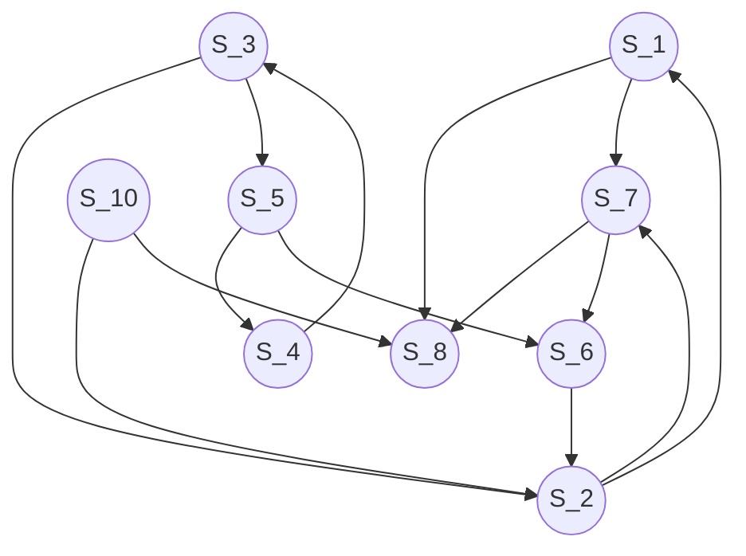

# Graphes

!!! warning
    Ce cours a été automatiquement traduit des transparents de M.Noyer par
    Lorentzo et Elowan et mis en forme par Mehdi, nous ne nous accordons en aucun cas son travail, ce
    site à pour seul but d’être plus compréhensible pendant les périodes de
    révision que des diaporamas.

## Crédits

- [Wikipédia : théorie des graphes](https://fr.wikipedia.org/wiki/Th%C3%A9orie_des_graphes)
- [Wikipédia : graphes simples](https://fr.wikipedia.org/wiki/Graphe_simple)
- Toujours le Mansuy.  

## Historique

### Les sept ponts de Königsberg

Un article du mathématicien suisse Leonhard Euler, présenté à  l’Académie de Saint-Pétersbourg en 1735 puis publié en 1741.  

Trouver une promenade à partir d’un point donné qui fasse revenir à  ce point en passant une fois et une seule par chacun des sept ponts  de la ville de Königsberg : **Circuit eulérien**.  Euler fut sans doute le premier à proposer un traitement  mathématique de la question, suivi par Vandermonde.

<p align='center'></p>

_Figure – Abstraction du problème des 7 ponts de Königsberg_

!!! definition "Théorème"
    Un graphe connexe admet un circuit eulérien _si et  seulement si_ tous ses sommets sont de degré pair.  Ici un des sommets a 3 voisins : pas de circuit eulérien.  

## Graphes, représentation, sous-graphes

### Informellement

Un graphe est un ensemble de points dans lequel on fait apparaître  une ou plusieurs relations(s) entre deux points.  Ces relations sont en général représentées par des flèches ou par des  segments. Dans le premier cas, le graphe est dit _orienté_ et les liens  sont appelés des _arcs_. Dans le second, le graphe est dit _non orienté_ et  les liens sont souvent appelés des _arêtes_.  Les points sont appelés les sommets (en référence aux polyèdres) ou  les nœuds (en références à la loi des nœuds).

<p align='center'></p>

_Figure – Un graphe orienté avec des arcs - un graphe non orienté et ses arêtes._

**Exemple : plan d’une ville.**  
<p align='center'></p>

_Figure – Un multigraphe non orienté : ses arêtes multiples en rouge et ses
boucles en bleu_

En anglais, sommet se dit _vertice_, arête se dit _undirected edge_ et arc  se dit _directed edge_.  
Les arêtes multiples ne sont pas au programme.  

### Graphe simple non orienté

La définition suivante ne s’applique pas aux graphes avec arêtes multiples.

!!! quote "Définition"
    Un graphe (simple) non orienté G est un couple (V, E) où E ⊆ P(V) est un ensemble de paires ou de singleton d’éléments de V. On appelle sommets les éléments de V et arcs ceux de E.

La lettre E est utilisée pour les arcs car en anglais, _arcs_ se dit _edge_.  
Certains auteurs utilisent un vocabulaire spécial pour les graphes non  orientés. Par exemple, une arête (undirected edge) désigne un arc.  
Soit a = {x, y}. On dit que :  

- a relie les sommets x et y, x et y sont adjacents ou encore **voisins**
- a est incidente avec x et y ou encore x et y sont incidents avec a.  

### Graphe simple orienté

Au programme ne figurent que les graphes avec au plus un seul arc d’un  sommet à un autre.

!!! quote "Définition"
    Un graphe simple orienté G est un couple (V, A) où :

    - V est appelé l’ensemble des sommets de G,
    - et A ⊆ $V²$  est un ensemble de couples d’éléments de V appelé  l’ensemble des arcs de G.
  
La lettre V est utilisée pour les sommets car en anglais, sommet se  dit vertex (au pluriel vertices).  
Un _arbre_ est un cas particulier de graphe orienté simple.  
Mais pour certains auteurs, un arbre est un graphe non orienté  connexe et acyclique (voir plus loin pour les définitions).  

Un arc est noté a = (x, y) ou a = x → y et on dit que :  

- a va de x à y
- x est l’extrémité initiale de a  
- y est l’extrémité terminale de a
- y est un voisin de x. a est incident à x et y  

### Degré

Dans un graphe général (orienté ou non), on appelle degré d’un  sommet s et on note d(s), le nombre d’arcs incidents au sommet s. (=Nombre d'arc d'un sommet)
Dans un graphe général orienté, on distingue le degré sortant ou  extérieur $d^{+}(s)$ qui est égal au nombre d’arcs dont s est l’extrémité  initiale et le degré entrant ou intérieur $d^{−}(s)$ qui est égal au nombre  d’arcs dont s est l’extrémité finale.  

!!!note inline end ""
    - $d^{-}(S_3) = 3$
    - $d^{+}(S_3) = 1$
    - $d(S_3) = 4$


### Matrice d’adjacence sommets-sommets

!!! quote "Définition"
    Soit G = (S, A) un graphe fini simple.
    Notons $\{v_1,..., v_n\}$ les sommets de S.
    On appelle matrice d’adjacence sommets-sommets de G = (S, A) la
    matrice n×n A = $(a_{ij})_1{≤i,j≤n}$ telle que
    
    $$
    a_{ij} = 
    \begin{equation} 
        \begin{cases}
            1 \text{ si il existe un arc de } v_i \text{ à } v_j\\
            0 \text{ sinon}
        \end{cases}
    \end{equation}
    $$

!!!tip ""
    **Remarque**

    - La matrice d’adjacence dépend de la numérotation des sommets. Il  faut que cette numérotation soit connue pour comprendre la matrice.  
    - A une numérotation des sommets correspond une unique matrice  d’ajacence sommets-sommets.  
    - Inadaptée pour les arêtes (ou les arcs) multiples. Présence de boucle  si $a_{ii} = 1$.  Graphe non orienté => matrice symétrique.  

### Liste d’adjacence

!!! quote "Définition"
    Soit G = (S, A) un graphe fini simple.

    On appelle liste d’adjacence de G toute liste de couples (s, l) où s parcourt S et l est une liste de ses voisins.

!!!tip ""
    **Remarque**

    Si une numérotation des sommets est choisie, on peut se contenter de
    donner la liste des voisins. La première liste donne les voisins du premier sommet, la seconde celle du second sommet etc...

### Exemple de repésentation

#### Cas non orienté

<p align='center'></p>

_Figure - Un graphe étiqueté non orienté_

##### Matrice d'adjacence

Matrice symétrique

$$\begin{pmatrix}0 & 1 & 1 & 1\\1 & 0 & 0 & 0\\1 & 0 & 0 & 1\\1 & 0 & 1 & 0\end{pmatrix}$$

##### Liste d'adjacence

```
[(’A’, [’B’, ’C’, ’D’]), (’B’, [’A’]), (’C’, [’A’, ’D’]), (’D’, [’C’, ’A’])]
```
ou
```
[[’B’, ’C’, ’D’], [’A’], [’A’, ’D’], [’C’, ’A’]]
```

#### Cas orienté

<p align='center'></p>

_Figure - Un graphe étiqueté orienté_

##### Matrice d'adjacence

Matrice non symétrique

$$\begin{pmatrix}0 & 1 & 1 & 0\\0 & 0 & 0 & 0\\0 & 0 & 0 & 1\\1 & 0 & 0 & 0\end{pmatrix}$$

##### Liste d'adjacence

```
[(’A’, [’B’, ’C’]), (’B’,[]), (’C’, [’D’]), (’D’,[’A’])] 
```
ou
```
[[’B’, ’C’], [], [’D’], [’A’]]
```

### Matrices d’adjacence : quelle représentation ?

En Ocaml ou C, les matrices d’adjacence sont simplement  représentées par des matrices carrées c.a.d. des tableaux à deux  dimensions avec même nombre de lignes que de colonnes.  

A la place de 0 et de 1, on peut utiliser vdes bouléens.  
Implicitement on considère que les sommets sont des nombres. Ou  alors on dispose d’un tableau de correspondance entre les sommets et  leurs numéros (utile si les sommets contiennent des informations).  

Avec un tel choix :  

- il est facile de supprimer ou d’ajouter un arc entre deux sommets  existants.  
- On teste en O(1) si deux sommets sont voisins.  
- Ajouter un sommet nécessite en général une copie de la matrice  (complexité quadratique).  
- Place mémoire perdue importante si beaucoup de sommets et matrice  creuse.  

#### Listes d’adjacence en Ocaml : quelle représentation ?

En Ocaml pour un graphe G = (V, E) :  
On peut considérer une liste L de longueur |V| de tuples (s, l) ou s  est un sommet et l la liste des voisins de s.  

!!!note ""
    - Avantages : pas de place mémoire perdue ; possibilité d’ajouter un  nouveau sommet après avoir vérifié que ce sommet n’est pas déjà dans  la liste.  
    - Inconvénients : Accès à la liste d’adjacence de s en O(|V|) ; test de  voisinage entre s et x en O(|V| + deg s) ; ajout d’un arc (s, x) en  O(|V| + deg s).  


On peut préferer gérer un tableau de listes l plutôt qu’une liste de  tuples (les sommets sont alors des nombres).  

!!!note ""
    - Avantage : l’accès à la liste d’adjacence de s est en O(1) ; test de  voisinage avec x en O(deg s) ; ajout d’un arc (s, x) en O(deg s) (il faut  vérifier que l’arc n’est pas déjà présent - usage de list.mem -).  
    - Inconvénient : pour ajouter un sommet, il faut recopier le tableau.  

#### Listes d’adjacence en C : quelle représentation ?  

##### Tableau de liste de chaînes

Dans le même esprit qu’en Ocaml, pour représenter G = (V, E)  
Tableau t des successeurs de chaque sommet.  t[i] pointe sur la liste des sucesseurs du sommet i.  Accès direct à un sommet via t.  Complexité spatiale optimale en O(|S| + |V|)  

<p align='center'></p>

_Figure – Un tableau de liste chaînée de successeurs. (F. Pesseaux)_

##### Partage physique des sommets

On peut aussi partager physiquement les sommets.  
Chaque sommet est représenté 1 et 1 seule fois.  Chaque sommet est associé à une liste dont les éléments pointent sur  ses successeurs.  

<p align='center'></p>

_Figure – Partage physique des données (F.Pesseaux)_

#### Sous-graphes

Convention : V pour vertice, E pour edge.  

- Un sous-graphe est un graphe contenu dans un autre graphe :  "$H = (V_H, E_H)$ est un sous-graphe de $G = (V_G, E_G)$ si $V_H ⊂ V_G$,  $E_H ⊂ E_G$ et pour tout arc (resp. arête) de $E_H$, les extrémités sont  dans $V_H$".  
On supprime des arcs et des sommets avec la contrainte qu’**il ne faut pas conserver d’arc dont une extrémité a été supprimée de
l’ensemble des sommets.**

- Un sous-graphe couvrant (ou graphe partiel) est un sous-graphe ayant  le même ensemble de sommets que le graphe qui le contient.  "H est un sous-graphe couvrant de G (ou H couvre G) si $V_H = V_G$  et $E_H ⊂ E_G$."  **On garde tous les sommets, on enlève certains arcs.**

- Un sous-graphe induit est un sous-graphe défini par un sous ensemble  de sommets.  "H est un sous-graphe induit de G si, pour tout $(x, y) \in V_H^2$, l’existence d’un lien entre x et y dans H est équivalente à l’existence  d’un lien entre x et y dans G."  
**On enlève des sommets, toutes les arêtes correspondant à ces
sommets et uniquement celles-là.**

#### Exemples

<p align='center'></p>

## Chaînes et chemins, connexité

### Accessibilité

#### Chaînes et Chemins

!!!note ""
    Soit G = (S, E) un graphe.  

    - Un chemin d’un sommet x à un sommet y est une séquence de (au  moins 2) sommets $x = x, x..., x_{n−1}, x_n$ = y dans laquelle chaque $x_i$  admet $x_i$ pour voisin.  
    - Un sommet y est _accessible_ depuis x s’il existe un chemin de x à y.  
    - La _longueur_ d’un chemin est égale au nombre d’arêtes qui la  constituent.  
    - Un chemin _simple_ est une chemin qui ne contient pas plusieurs fois  une même arête/arc (on dit aussi _eulérien_).  
    - Un chemin _élémentaire_ est une chemin qui ne passe pas plusieurs fois  par un même sommet.  
    - élémentaire => simple.  
    - En CPGE, les chaînes sont souvent élémentaires (pas de doublon de  sommet sauf pour définir les cycles).  
    - Certains auteurs utilisent le mot chaîne pour désigner les chemins  dans les graphes non orientés.  

    Un chemin est dit simple ou eulérien si chacun de ses arcs/arêtes  n’est emprunté qu’une fois.

#### Cycles et circuits

Un cycle $x_0, x_1,..., x_n$ est un chemin eulérien dont les extrémités sont  confondues (souvent on le suppose simple).  
Un cycle est dit _élémentaire_ si, lorsqu’on enlève un arc quelconque, le  chemin restant est élémentaire.  
Un graphe est acyclique s’il ne possède aucun cycle.  
Certains auteurs distinguent la notion de circuit (pour les graphes orientés) de celle de cycle (pour les graphes non orientés)  

#### Distance et diamètre

La distance entre deux sommets x et y d’un graphe G = (S, A)  orienté (resp. non orienté) est notée $d_G (x, y)$ et est égale à la  longueur d’un plus court chemin (resp. chaîne) allant de x à y s’il en  existe un ou bien $+\infty$ sinon.

Il s’agit bien d’une distance au sens mathématiques. En particulier,  elle vérifie l’inégalité triangulaire  
$\forall (x, y, z) \in S^3, d_G (x, z) \leq d_G (x, y) + d_G (y, z)$. 

Le diamètre d’un graphe G est la valeur : $sup_{(x,y) \in S^2} d_G (x, y)$. C’est "la longueur du plus long plus court chemin entre deux sommets".  

### Connexité

#### Relation de connexité

La connexité dans un graphe non orienté est une relation binaire entre  deux sommets : x et y sont en relation de connexité si et seulement si  y est accessible depuis x.  
Comme le graphe est non orienté, si y est accessible depuis x, alors x  est accessible depuis y.  La connexité est une relation d’équivalence.  Les classes d’équivalences sont appelées composantes connexes. La  composante connexe d’un sommet x est notée ici $\dot{x}$ et vaut :  

$$\dot{x} = \{y ∈ V| \text{ il existe une chaîne de x à y }\}$$

Un graphe est dit _connexe_ si il possède une seule composante  connexe. La connexité est étendue aux graphes orientés en ne tenant pas compte du sens des arcs.  

#### Relation de forte connexité

La relation de forte connexité est une relation binaire entre sommets  d’un graphe orienté : x et y sont en relation de forte connexité si et  seulement si  

- il existe un chemin de x à y et il existe un chemin de y à x 
- ou bien x = y.  

_Il peut y avoir un chemin de x à y sans chemin de y à x._

Les classes d’équivalence de la relation de forte connexité sont  appelées composantes fortement connexes. La composante fortement connexe de x, notée ici $\tilde{x}$ vaut :  

$$ \tilde{x} = \{y \in S| \text{il existe un chemin de x à y et de y à x} \} $$

Elle vérifie $\tilde{x} ⊂ \dot{x}$. **L’inclusion réciproque est en général fausse.**

On dit qu’un graphe est fortement connexe si et seulement si il est  constitué d’une seule composante fortement connexe, c’est à dire si  pour tout couple de sommet (x, y) il existe un chemin allant de x à y  et réciproquement.  

#### Connexité : exemple



_Graphe connexe (quand on ne considère pas le sens des flèches)._

$S_8$ est accessible depuis tous les sommets.  $\tilde{S_8} = \{S_8\}$. Donc le graphe n’est pas fortement connexe, sinon $\tilde{S_8}$  contiendrait tous les sommets.  

- Sommets accessibles depuis $S_2 : \{S_1, S_2, S_6, S_7, S_8\}$.  
- Sommets coaccessibles depuis $S_2 : \{S_1, S_2, S_5, S_6, S_7, S_{10}\}$.  
- $\tilde{S_2} = \{S_1, S_2, S_6, S_7\}$ est l’intersection des accessibles et des  coaccessibles.  

#### Isthme

Une arête u d’un graphe G non orienté est appelée un _isthme_ si sa suppression met ses extrémités dans deux composantes connexes  différentes (donc la suppression augmente le nombre de composante  connexes du graphe).  

<p align='center'></p>

Une seule composante connexe.  

<p align='center'></p>

Deux composantes connexes après suppression de $\{S_4, S_5\}$.  

!!!warning ""
    **Proposition**

    Soit G un graphe non orienté. Une arête u est un isthme si et seulement si u n’appartient à aucun cycle  de G.  

???+note "Preuve"
    Soit $u = \{x, y\}$ une arête avec $x \neq y$. On montre que u est un isthme si et  seulement si u n’appartient à aucun cycle de G  

    - Supposons que u soit un isthme. Supprimer u met x, y dans deux  composantes connexes différentes. Cela veut dire qu’il n’existe pas de  chemin de x à y qui ne passe pas par u. Et donc, u n’est sur aucun  cycle.  
    - Si u n’appartient à aucun cycle, supposons qu’il y ait un chemin  allant de x à y ne passant pas par u (on peut le prendre élémetaire).  En y ajoutant u, on obtient un cycle passant par u : ABSURDE.  
    Si on supprime u, on ne peut donc plus joindre y depuis x. Alors x, y  sont dans deux CC différentes. On en déduit que u est un istme.  

#### Nombre d’arêtes et de sommets

!!!warning ""
    **Proposition**

    Soit G un graphe non orienté sans boucle de n sommets et p arêtes.  

    - G connexe => p ≥ n − 1,  
    - G acyclique (i.e. pas de cycle simple) => p ≤ n − 1.  

!!! quote "Corollaire"
    Si G non orienté sans boucle est acyclique connexe, alors p = n − 1.

???+note "Preuve"

    ##### Si G = (V, E) non orienté est connexe, p ≥ n − 1

    Par récurrence forte :

    - Vrai si n = 1. Alors p ≥ 0. Le graphe est connexe et p ≥ n − 1.  
    - Si n = 2, il faut qu’il y ait une arête entre les deux sommets pour que  le graphe soit connexe. Alors p ≥ 1 = n − 1.  
    - Cas de base : OK. (Remarque on pourrait ajouter des boucles ça ne  changerait rien).  
    - Si P(k) pour n ≥ 2 et tout k ≤ n. Soit G connexe à n + 1 sommets. Tout sommet possède au moins une arête incidente car G est connexe.  
  
        - Si G possède un sommet x de degré d(x) = 1, x n’est sur aucune  chaîne simple joignant deux autres sommets. On supprime x et son  unique arrête adjacente, le sous-graphe G' obtenu est connexe à n  sommets. Par HR le nombre d’arêtes de G' est p' ≥ n − 1. En  remettant l’arête de x, on a au moins (n + 1) − 1 arêtes dans G.  
        - Sinon, tous les degrés sont ≥ 2. La somme des degrés dans un graphe est $\sum_{x \in V}d(x) = 2p$ car toutes les arêtes sont comptées deux fois. On  a donc 
        $$2p = \sum_{x \in V} \underbrace{d(x)}_{\geq 2} \geq 2|V| = 2n+2 $$ 
        Donc $p \geq n+1 \geq (n+1) - 1$. OK


    ##### Si G est non orienté sans boucle a au moins n arêtes, il n’est pas acyclique  
    On considère des graphes NO à au moins 3 sommets. On raisonne par  récurrence forte sur |G| = n.  
    
    - Cas de base n = 3. S’il y a 3 arêtes, le graphe tout entier est un cycle.  
    - Supposons P(k) pour k ≥ 3 et tout k ≤ n. Soit G à n + 1 sommets et  p = n + 1 arêtes. On montre qu’il possède un cycle. 
    Considérons un  sommet quelconque x.  

        - S’il n’y a pas d’arête incidente à x, le graphe privé de x a n sommets  et n + 1 arêtes. Il y a un cycle par HR.  
        - Si il existe une arête incidente à x qui n’est pas un isthme elle est  alors sur un cycle et G possède donc un cycle : OK.  

        - Si toutes arête x-incidente est un isthme, soit $u = \{x, y\} \in A$.  Retirons u. Alors x se retrouve dans une composante connexe  différente de celle de y.  
        Séparons la composante connexe de x et ses arêtes (formant un sous graphe $G_1$) du reste du graphe (notons $G_2$ ce reste).  
            - $G_1$ possède, disons k sommets (1 ≤ k < n + 1), l’autre n + 1 − k. $G_1$ possède $q_1$ arêtes et $G_2$ en a $q_2$ avec $q_1 + q_2 = n$.  
            - Si $q_1 ≥ k$, il y a un cycle dans $G_1$ par HR donc dans G puisque $G_1$ est  un sous-graphe de G : Prouvé.  
            - Sinon, $q_2 = n − q_1 > n − k$ donc $q_2 ≥ (n − k) + 1$ et le sous-graphe G par HR a un cycle donc G aussi. CQFD  

#### Caractérisation des arbres non enracinés

!!! quote "Définition"
    On appelle _arbre non enraciné_ tout graphe non orienté sans boucle acyclique et connexe.

!!! quote "Remarque"
    On dit en général _arbre_ plutôt que _arbre non enraciné_ mais cette appelation amène des confusions avec la notion d’arbre définie inductivement.


!!! quote "Proposition"
    Soit un graphe non orienté sans boucle G de n sommets et p arêtes, les  affirmations suivantes sont équivalentes :  
    - G est un arbre non enraciné,  
    - G est acyclique et contient n − 1 arêtes (p = n − 1),  
    - G est connexe et contient p + 1 sommets.  
  
On a déjà vu les sens directs.  

!!!note ""
    **Preuve**

    ##### Si G acyclique et n = p − 1  
    Si x, y sont deux éléments non reliés par un chemin, on ajoute l’arête  {x, y }  
    Cela crée un cycle puisque le nombre d’arête est égal à celui des  sommets.  
    Ce nouveau cycle passe par l’arête {x, y} (avant, il n’y en avait pas).  
    Puisque cycle il y a, c’est que x et y sont joignables sans passer par  {x, y} : Absurde.  
    Done pour tous sommets x et y, il y a un chemin de l'un à l'autre : G est donc connexe

    ##### Si G est connexe et n = p − 1  
    Si G possède un cycle, soit {x, y } une arête de ce cycle.  
    Alors il y a un autre chemin de x à y que cette arête. Donc on peut  enlever l’arête {x, y } en conservant le caractère connexe.  
    Mais alors le nouveau graphe G' est encore connexe et possède n  sommets et n − 2 arêtes. ABSURDE  

## Graphes particuliers

### Arbres et forêts

Pour certains auteurs, un arbre est un graphe non orienté connexe et  acyclique. S’il a n sommets, il possède donc n − 1 arêtes.  
Comme il y a conflit avec la définition du cours, ces graphes non  orientés connexes acycliques sont dits arbres non enracinés (on l’a  déjà vu).  
_À contrario_, on parle des objets du premier chapitre (définis  inductivement) comme des _arbres_.  

Dans un arbre non enraciné, on peut choisir une _racine_. Il y a alors un  chemin unique de la racine à tous les sommets (cela se montre). La  présence de la racine induit alors une orientation.  La structure ainsi construite est ce que certains auteurs appellent  _arborescence_ ou _arbre enraciné_ (cf def 6)  

Une arborescence n’est pas encore un des objets que nous manipulons  sous le nom d’arbres. Il n’y a pas, dans les arborescences de notion  comme fils gauche et fils droit. Il manque une notion de latéralisation.  

#### Forêts

Une _forêt_ est un graphe non orienté acyclique, c’est une union disjointe  d’arbres non enracinés (qui en sont les composantes connexes).  

#### Exemples

!!!danger "Image page 51"

#### Racine, arborescence

!!! quote "Définition"
    Un sommet r d’un graphe orienté G = (V , E) est une racine de G si  pour tout sommet x de G il existe un chemin de r à x.  
    
    On dit qu’un graphe orienté G = (V , E) est une _arborescence_ s’il  possède un unique élément $x_0$ de degré entrant nul, si tous les autres  sont de degré entrant 1 et si il existe un chemin de $x_0$ à tous les  autres sommets.  

#### Exemples

!!!danger "Image page 53"

### Graphes non orientés particuliers

#### Statut de cette section

Cette section donne quelques exemples de graphes particuliers sans  qu’aucune preuve ne soit donnée.  

#### Etoiles, peignes, chenilles

_Etoile_ : Un arbre dont un sommet est adjacent à tous les autres.

!!!danger "Image page 56"

_Chenille_ : arbre tel que tout sommet de degré $\geq$ 2 est adjacent à au plus deux sommets de degré $\geq$ 2.
<p align='center'></p>

_Peigne_ : Bon j'ai vraiment besoin de décrire ça ?

<p align='center'></p>

#### Graphe planaire

Un graphe est _planaire_  si on peut le dessiner sans  qu’aucune arête n’en coupe  une autre.  

_4-coloriabilité_ :  les sommets d’un graphe planaire  peuvent être coloriés  avec 4 couleurs sans  que deux sommets adjacents  ne soient de la même couleur.  

<p align='center'></p>

#### Graphe complet, tournoi

!!!danger "Image page 58"

Un graphe _complet_ est un graphe  non orienté où  tous les sommets sont deux à deux adjacents.  

Un _tournoi_ est un graphe orienté  obtenu à partir d’un graphe complet  en orientant chaque arête.  

#### Graphe biparti

Un graphe _biparti_ G = (V , E)  est un graphe (orienté ou non orienté)  admettant une partition $\{P_1, P_2\}$  de ses sommets telle que  {x, y } ∈ E => $(x, y) ∈ P_1 × P_2 ∪ P_2 × P_1$  

Les arbres (et plus généralement les forêts)  sont des graphes bipartis.  

<p align='center'></p>

#### Graphe biparti complet

!!!danger "Image page 60"

Un graphe est dit _biparti complet_ (ou encore est appelé une _biclique_) s’il  est biparti et contient le nombre maximal d’arêtes.  Si P est de cardinal m et $P_2$ est de cardinal n le graphe biparti complet  est noté $K_{m,n}$.  

## Un peu de OCAML

### Liste d’adjacence

!!!danger "Image"

```ocaml linenums="1"
type graphe = int list array ;;
(* graphe orient é *)
let g1 = [| [1; 2]; [2] ;[ 0]|];;
(* graphe non orient é *)
let g2 = [ |[ 1 ; 2 ]; [ 2 ; 0 ] ; [0 ;1 ] |] ; ;
```

Les sommets sont numérotés de 0 à |g | − 1.  

Voir TD pour les exercices  
  
!!!danger "Je suis pas allé plus loin"
#### Matrice d’adjacence


```linenums="1"
type graphe = int array array ;;
let g = Array . make_matrix 4 4 0;;
g .(0) .(1) < -1; g .(0) .(2) < -1; g .(1) .(3) < -1; g .(2) .(1) < -1;;
```

  
  
  


(cid:47) 3  
0  
1  
2  
Voir TD pour les exercices  
  

##   


 Historique  
 Graphes, représentation, sous-graphes  
 Chaînes et chemins, connexité  
Accessibilité  Connexité  
 Graphes particuliers  
Arbres et forêts  Graphes non orientés particuliers  
 Un peu de OCAML   Parcours de graphes  Présentation  Parcours en largeur d’abord  Parcours en profondeur d’abord  Graphe acyclique  Tri topologique  Composantes fortement connexes (CFC)  

#### Définition


En théorie des graphes, un parcours de graphe est un algorithme  consistant à explorer les sommets d’un graphe de proche en proche à  partir d’un sommet initial. Un cas particulier important est le parcours  d’arbre.  Un parcours d’un graphe permet de choisir, à partir des sommets  visités, le sommet suivant à visiter.  Le problème consiste à déterminer un ordre sur les visites des  sommets.  Une fois le choix fait, l’ordre des visites induit une numérotation des  sommets visités (l’ordre de leur découverte) et un choix sur l’arc ou  l’arête utilisé pour atteindre un nouveau sommet à partir des sommets  déjà visités.  Les arcs ou arêtes distingués forment une arborescence ou un arbre, et  les numéros des sommets sont croissants sur les chemins de  l’arborescence ou les chaînes de l’arbre depuis la racine.  

#### Finalité


Les algorithmes de parcours ne sont pas une fin en eux-mêmes. Ils servent  comme outil pour étudier une propriété globale du graphe, par exemple :  
Connexité et forte connexité  
Existence d’un circuit ou d’un cycle et, le cas échéant, définition d’un  ordre total sur les sommets compatible avec le sens des arcs (ce qu’on  appelle tri topologique)  
Calcul des plus courts chemins (notamment l’algorithme de Dijkstra)  
Calcul d’un arbre recouvrant (notamment l’algorithme de Prim)  
Algorithmes pour les flots maximums (comme l’algorithme de  Ford-Fulkerson).  
Coloration des sommets etc.  

#### Analyse


La difficulté de l’exploration consiste à éviter de visiter plusieurs fois  un même sommet. Pour cela on met en oeuvre un marquage des  sommets par des couleurs.  Lors d’une exploration, chaque sommet passe par trois couleurs :  
bleu tant que la visite du sommet n’a pas commencée  vert dès que sa visite commence et tant le traitement n’est pas terminé  rouge dès que le traitement est terminé  
L’exploration à partir d’un sommet s ne permet pas nécessairement  d’explorer tout le graphe (il peut y avoir plusieurs CC/CFC). Pour  effectuer une exploration complète il faut relancer le parcours à partir  d’un sommet bleu tant qu’il en existe.  

#### Parcours à partir d’un sommet


```linenums="1"
t a n t q u e             
f a i r e
s i
s i n o n
s i
```

On gère une structure S (pile, file, ou autre). On dispose d’une fonction  d’ajout (dans) et de retrait (de) cette structure. Depuis un sommet donné  on peut sélectionner un successeur (par exemple un voisin).  Le parcours débute par un sommet s.  
∗                            
    
                 S          s            


    
                       s ∗  
s       
  
  
  
  
  
  
  
         s  S           
s      
s    
   
                                              
              
              S   
                  
         S  

s ∈ S   
   
                      
                
s    
Dès qu’un sommet bleu est abordé, il devient vert. Suivant les traitements,  on peut choisir de traiter s à plusieurs endroits (L6 ou L11).  
   
  

#### Graphe de liaison induit


Soit G = (V , E) un graphe et s ∈ S. On appelle graphe de liaison  induit par l’exploration de G à partir de x, le sous-graphe de G  engendré par les arêtes {u, v } ∈ E (resp. les arcs) par lesquelles  passent l’exploration de G , (l’exploration passe par {u, v } (resp.  (u, v)) si celle-ci provoque le coloriage du sommet v en vert).  Pour un parcours depuis s :  
on débute avec le graphe (s, ∅)  lors du passage du parcours par un sommet s vert on ajoute chaque  voisin bleu t et l’arête (resp. arc) {s, t} (resp. (s, t)) au graphe induit  (mais peut-être pas tous en même temps).  On construit ainsi un graphe connexe ayant k sommets et k − 1 arêtes,  autrement dit un arbre ou une arborescence.  
Le graphe de liaison induit par une exploration complète de G est un  ensemble d’arbre ou d’arborescence.  

#### Tableau de couleurs


On colorie tous les sommets en bleu (O(n)) puis on lance  l’exploration de n’importe quel sommet.  
Lors d’un parcours, chaque sommet entre au plus une fois dans  l’accumulateur Verts , et n’en sort qu’au plus une fois (quand il  devient rouge).  
On s’arrange pour que que ces opérations d’entrée et de sortie  dans/de l’accumulateur sont de coût constant. Pour réaliser cette  condition, la solution que nous adoptons consiste à utiliser un tableau  de couleurs R,V,B.  

###   

#### Algorithme


L’ensemble des sommets Verts est représenté par une file  (bibliothèque OCAML queue par exemple)  Principe : on explore le graphe à partir d’un sommet en visitant  d’abord tous les sommets voisins (à une distance 1), puis tous les  sommets voisins de ses voisins (à une distance 2)....  


```linenums="1"
p r o c e d u r e                
t a n t que      
f a i r e
p o u r                
s i         a l o r s
p r o c e d u r e                             
a l o r s
s i
```

F : file des sommets verts.  

            
         
       
          

         

        ∗                     ∗  
                

          
                        

  
  
  
  
  
  
  
  
  
  
  
  
  
  
         
    
       
          
                  
             ∗         
      ∗  
Variant de boucle tant que : nombre de sommets bleus + nombre de  sommets verts. L’algorithme termine.  
     
  

#### Coût des opérations de file


Pour un graphe G = (V , E) avec |E | = p et |V | = n  
Tous les sommets sont coloriés en bleu exactement une fois au début  puis plus jamais : O(n).  
Un sommet finit toujours par entrer dans la file (soit du fait de la  boucle tant que , soit du fait de Largeur).  Du fait des tests de couleurs, il n’y entre qu’une fois.  
Un sommet finit toujours par quitter la file car l’algorithme termine.  
Les opérations d’enfilement/défilement sont en O(1). Le coût total de  gestion de file est en Θ(n).  

#### Gestion des listes d’adjacence


Pour un graphe G = (V , E) avec |E | = p et |V | = n  
Une liste d’adjacence donnée n’est balayée qu’une fois et une seule  (puisque chaque sommet est ajouté dans la file puis défilé une fois et  une seule). Chaque élément de cette liste donne lieu à des opérations  de coloriage/enfilement en O(1).  
La somme des longueurs des listes d’adjacence est en Θ(|E |) = Θ(p).  Donc le temps total consacré au balayage des listes d’adjacence est en  Θ(p).  
Enfin la coloration initiale est en Θ(n).  
Le total des opérations est en Θ(n + p) pour le parcours en largeur.  

#### Propriétés du parcours en largeur d’abord


Considérons un parcours en largeur depuis un sommet s :  
s est le premier sommet rouge. Un sommet devient rouge avant ses  sucesseurs dans l’ordre de parcours.  Un sommet rouge n’a que des sommets adjacents verts ou rouges (en  exo).  Si un sommet x est rouge alors il existe une chaîne/chemin allant de s  à x constituée uniquement de sommets rouges (en exo).  Si un sommet x est vert alors il existe une chaîne/chemin allant de s à  x constituée uniquement de sommets verts ou rouges (en exo).  A la fin du parcours tous les sommets sont soit bleus, soit rouges (et la  file des verts est vide).  
Conséquence : à la fin de l’appel de Largeur les sommets rouges sont  tous les sommets accessibles à partir de s.  

#### Preuve : accessiblité = coloration en rouge


Posons G = (V , E) et faison un bfs depuis s ∈ V . On montre qu’il y a un  chemin vert/rouge depuis s vers tout sommet de la file, et qu’existe un  chemin totalement rouge de s vers tout sommet rouge.  
Au tour 1, s sort de la file et devient rouge. Alors il y a un chemin  rouge de s à s. Et tous les voisins de s deviennent verts : donc il y a  un chemin rouge/vert vers eux.  Supposons la propriété vraie au tour k. Soit s le sommet défilé au  tour k + 1. Il faut vérifier la propriété pour le nouveau sommet rouge  et les nouveaux verts.  
s devient rouge. Puisque s était dans la file, il y a été placé par un  sommet x qui est devenu rouge. Par HR, il y a un chemin rouge de s à  x et donc (en ajoutant l’arc (x, s)) de s à s.  Tout sommet y qui devient vert est un voisin de s. Comme il y a un  chemin rouge de s à s, il y a un chemin rouge/vert de s à y .  


Posons G = (V , E) et faisons un bfs depuis s ∈ V .  
Si un sommet x est rouge, il y a un chemin (rouge) depuis s vers x  donc x est accessible.  Réciproquement. On montre que si un sommet est à une distance  k ≤ n de s, alors il est rouge à la fin du BFS.  
Vrai pour la distance d = 0. s est accessible depuis s et il est rouge.  Cas de base OK.  Si la propriété est vraie pour tout sommet accesible à la distance k de  s, soit x à la distance k + 1 (s’il n’existe pas de sommet à la distance  k + 1, il n’en existe pas non plus à une distance supérieure et la  propriété est prouvée).  Alors le prédécesseur y de x dans un PCC de s à x est à la distance k  de s (un sous-chemin de PCC est un PCC). Par HR, il devient rouge à  un moment.  Donc si x est bleu au moment où y devient rouge, alors y le marque en  vert et x finit par devenir rouge.  Et si x est déjà marqué quand y devient rouge, alors x devient rouge.  (Tout sommet qui entre dans la file en sort et devient rouge)         


Voir cette animation  


 Historique  
 Graphes, représentation, sous-graphes  
 Chaînes et chemins, connexité  
Accessibilité  Connexité  
 Graphes particuliers  
Arbres et forêts  Graphes non orientés particuliers  
 Un peu de OCAML   Parcours de graphes  Présentation  Parcours en largeur d’abord  Parcours en profondeur d’abord  Graphe acyclique  Tri topologique  Composantes fortement connexes (CFC)  

#### Présentation


Principe : on explore le graphe à partir d’un sommet x en visitant l’un  de ses sommets successeurs y et en poursuivant l’exploration d’abord  par les successeurs de ce dernier avant les autres successeurs de x.  
Ainsi l’exploration s’effectue en suivant le plus loin possible une  chaîne issue de x. Lorsque tous les successeurs d’un sommet ont été  visités, on continu l’exploration en remontant dans la chaîne au  premier sommet ayant encore des successeurs non visités.  
On gère une pile des sommets verts (bibliothèque OCAML listes ou  stack, python : listes ou classe deque)  

#### Algorithme


```linenums="1"
p r o c e d u r e                   
t a n t que   
f a i r e
dans   ```

On utilise une pile pour gérer les sommets verts.  

  
         
    ∗           
                     
           
          ∗  
                                
      
 ∗              ∗  
                         
  
  
  
  
  
  
  
  
  
  
         
                 ∗           
       

       
    
      ∗  
             

  
  
  
                                        
 ∗                  
      ∗   
   
     
  

#### En pratique


Un même nœud s apparaît plusieurs fois au sommet de la pile. Il faut  donc gérer un marqueur de progression dans sa liste de voisins pour  éviter de reprendre cette liste depuis le début à chaque passage de s  au sommet de la pile.  
Solution : considérer les listes de voisins comme des piles. On dépile  jusqu’à trouver un sommet bleu. Les voisins dépilés ne reviennent  jamais dans la pile de voisins.  Cela impose de faire une copie du graphe (O(n) si le graphe est un  tableau de listes de voisins.)  

#### Nombre d’opérations due à un sommet


On analyse le nombre d’opérations engendrées par la présence d’un  sommet donné s en haut de la pile. Il suffira de sommer sur tous les  sommets pour obtenir la complexité totale. (Ajouter aussi le coût  d’initialisation en O(n).  
Le sommet s entre toujours dans la pile (soit du fait de la boucle tant  que, soit du fait de Profondeur). Le coloriage assure que le sommet  ne revient pas dans la pile verte quand il l’a quittée.  Le sommet s apparaît au plus deg s  + 1 fois au sommet de la pile  (s’en convaincre avec le graphe x → y).  A chaque apparition au sommet de la pile verte, il y a une recherche  d’un voisin bleu (on peut la rendre AU TOTAL en O(deg s) pour tout  l’algo) ; un coloriage/empilement dans la pile verte parfois (au plus  deg s  fois).  s est dépilé puis colorié en rouge une seule fois.  
La présence de s en haut de la pile engendre donc un nombre  d’opérations (majoré par un nombre) proportionnel à son nombre de  présences au sommet, soit 1 + deg s .  

#### Complexité totale


Pour un graphe G = (V , E) avec |E | = p et |V | = n  
On somme les nombres d’opérations occasionnées par chaque sommet  pour obtenir la complexité totale.  
Le nombre total d’opération est (majoré par un nombre) proportionnel  à  
{sum symbol}  
s∈V (1 + deg s) = n + {sum symbol}  
i∈V deg s = n + p = O(n + p)  
Même si on ajoute le coût d’initialisation en O(n), l’ensemble reste en  O(n + p)  

#### Observations


Les invariants suivants sont maintenus  
A tout moment, la pile décrit un chemin entre s (la base) et le haut  de la pile.  
Lorsqu’on colorie un sommet x en vert, tous les sommets bleus  accessibles à partir de x seront coloriés en rouges avant que x ne le  soit.  
A la fin du parcours, l’ensemble des sommets rouges est l’ensemble  des sommets accessibles à partir de s qui étaient bleus au moment  l’entrée de s dans la pile.  


Voir cette animation  

#### Vocabulaire


S  
S  
(cid:47) S  
S  
(cid:47) S  
(cid:47) S  
S  
S  
S  
S  
Soit Gl = (V , L) le graphe de liaison induit par le parcours en  profondeur d’un graphe G . Un arc u → v est :  un arc de liaison si et seulement si u → v ∈ L  un arc retour si et seulement si u est un descendant de v dans L.  un arc avant si et seulement si v est un descendant de u dans L et  u → v /∈ L (on prend de l’avance par rapport au cheminement normal  dans L)  un arc couvrant sinon (tous les autres arcs).  

#### Variante


Certains auteurs, gèrent le parcours en profondeur comme le parcours  en largeur mais utilisent juste une pile et non une file.  
Dans ce type de parcours, un même sommet n’apparaît qu’une seule  fois au sommet de la pile verte.  
Dès qu’un sommet apparaît au sommet de la pile, il est dépilé (une  fois pour toute) et on ajoute en une seule fois tous ses voisins bleus  au sommet de la pile. Un sommet devient alors rouge avant ses  successeurs.  
L’écriture du programme est alors plus simple, puisqu’une même liste  de voisins n’est parcourue qu’une fois pour toute (alors qu’avec ma  version, on la parcourt "par bouts" en y revenant plusieurs fois).  
En revanche, on perd une propriété importante : la pile ne décrit plus  exactement un chemin de la base au sommet mais est un simple  accumulateur de sommets rencontrés.  


```linenums="1"
t a n t que      
f a i r e
p o u r                   
s i         a l o r s
dans 
```

          
        
                     
         
       
                      

  
  
  
  
  
  
  
  
          ∗            
        ∗  
∗      
    
                        
    ∗  
               
                     
               ∗          
    
       ∗  
A noter qu’il n’y a plus vraiment de raison d’utiliser trois couleurs ; deux  suffisent.  
     
  

###   

#### Généralités


```linenums="1"
acyclique ```

Graphe : un graphe qui ne contient pas de circuit/cycle.  Certain problèmes n’ont de solution que pour des graphes acycliques :  plus court chemin, ordonnancement...  
Si un graphe est acyclique on peut concevoir des algorithmes qui  s’arrangent pour traiter tous les prédecesseurs d’un sommet donné  avant de traiter ce sommet (variante du parcours en profondeur).  


```linenums="1"
Cas des graphes orientés
Propriété ```

Propriétés  
: Un graphe contient un circuit si et seulement si lors du  parcours en profondeur l’un des successeurs du sommet en haut de la  pile verte est déjà vert.  
Exemple  
S  
S  
(cid:47) S  
S  
(cid:47) S  
(cid:47) S  
S  
S  
S  
S  
S  S  S  S  S a pour successeur S qui est déjà vert =⇒ un circuit.  


```linenums="1"
Cas des graphes orientés
```

Propriétés  
Autre façon de dire que le graphe est acyclique : le graphe de liaison  induit par un parcours en profondeur d’un graphe sans circuit ne  génère aucun arc retour.  
Exemple  
S  
S  
(cid:47) S  
S  
(cid:47) S  
(cid:47) S  
S  
S  
S  
S  
Il y a des arcs retour (en vert)  =⇒ des circuits  


```linenums="1"
Cas des graphes orientés
```

Propriétés  
L’algorithme pour la détection de circuit dans un graphe est une variante  du parcours en profondeur : quand on examine les arcs issus du sommet de  la pile, il suffit de regarder si un arc ne pointe pas vers un nœud vert. On  s’arête dès que c’est le cas.  

#### Preuve de la méthode


!!! quote "Définition"
    S’il existe un arc retour


!!! quote "Définition"
    Réciproquement Supposons l’existence d’un cycle. On peut enlever des


```linenums="1"
Cas des graphes orientés
```

On montre que la présence d’un cycle est équivalente à l’existence d’un arc  retour.  
Si la pile verte V a r > 1 sommets, le dernier  
sommet vert a été ajouté parce qu’il existe un arc de  V [−2] à V [−1] (notations Python).  Par récurrence, on obtient l’existence d’un chemin de  tout sommet dans la pile vers les sommets supérieurs.  Donc si on empile un sommet, et qu’un de ses  successeurs est déjà vert (ce qui est la définition d’un  arc retour), il y a un cycle.  
sommets juqu’à ce qu’il ne contienne que des sommets  distincts.  


```linenums="1"
Cas des graphes orientés (Réciproque)
```

Preuve de la méthode  
Supposons l’existence d’un cycle. On peut le considérer sans doublon  (sinon enlever des sommets juqu’à ce qu’il ne contienne que des sommets  distincts).  Soit x le premier sommet du cycle à être empilé. Tous les autres sommets  du cycle sont bleus.  
Le second sommet du cycle sera vert avant que x devienne rouge  puisque c’est un voisin de x.  
De proche en proche, on établit que à un moment tous les sommets  du cycle sont dans la pile. Donc, le dernier sommet du cycle avant x,  notons le y , devient vert alors que x est encore dans la pile. Comme il  y a un arc (y , x), cet arc est un arc retour.  


 Historique  
 Graphes, représentation, sous-graphes  
 Chaînes et chemins, connexité  
Accessibilité  Connexité  
 Graphes particuliers  
Arbres et forêts  Graphes non orientés particuliers  
 Un peu de OCAML   Parcours de graphes  Présentation  Parcours en largeur d’abord  Parcours en profondeur d’abord  Graphe acyclique  Tri topologique  Composantes fortement connexes (CFC)  

###   
