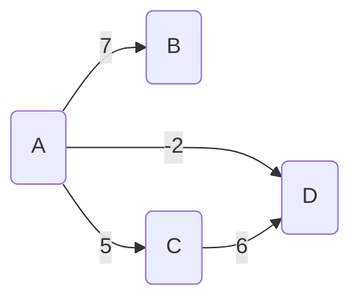
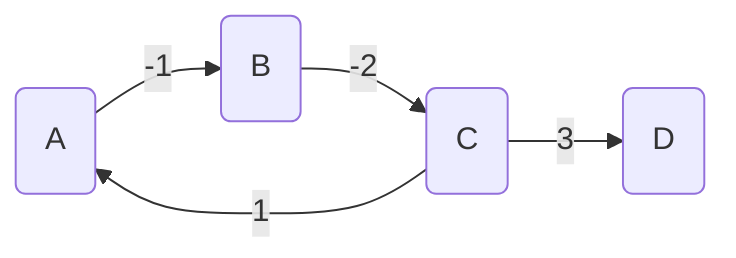

# Plus cours chemin

!!! danger
    Ce cours n'a pas été entièrement reverifié après le passage du programme. Pensez à supprimer ce message si vous avez reverifié ce cours

!!! warning
    Ce cours a été automatiquement traduit des transparents de M.Noyer par
    Lorentzo et Elowan et mis en forme par Mehdi, nous ne nous accordons en aucun cas son travail, ce
    site à pour seul but d’être plus compréhensible pendant les périodes de
    révision que des diaporamas.

## Généralités

### Graphe pondéré

!!!quote "Définition : Graphe pondéré"
    On dit qu'un triplet $G = (V, E, p)$ est un graphe pondéré si le couple $(V,E)$ est un graphe et si p est une fonction de E dans $\mathbb{R}$

On dit que _p_ est la (fonction de) _pondération_. Souvent notée $w$ pour weight.

Si $e \in E$, alors $p(e)$ est le _poids_ de $e$ ou _pondération_ de $e$.

Les graphes sont munis par défaut de la fonctoin de pondération $p:E \to \mathbb{R}, e \mapsto 1$. Donc tout graphe est un graphe pondéré qui s'ignore.

### Poids d'une chaîne

!!!quote "Définition : Poids d'une chaîne"
    Le _poids_ d'une chaîne (resp. chemin) d'un graphe pondéré non orienté (resp. orienté) est la somme des poids des arêtes(resp. arcs) de la chaîne (resp. chemin).

Si $c$ est la chaîne $x_1, \dots, x_n$ :

$$p(c) = \sum_{i=1}^{n-1} p(\{x_i, x_{i+1}\})$$

Ecrit un graphe ABCD avec les poids 7 5 -2 et 6 en mermaid :



$p(ACDA) = -2 +6 +5 = 9$

$p(ADC) = -2+6 = 4 \text{ et } p(AC)=5$

Le _plus court chemin_ de A à C est ADC

### Le plus court chemin

Etant donné un graphe pondéré, on recherche le plus court chemin d’un sommet à un autre (ou à tous les autres, ou le plus court chemin entre tous les couples de sommets...)

!!!example ""
    **Exemple :**

    Dans une carte routière de la France, les villes étant des sommets, les routes étant des arcs, chercher le (ou les) trajet(s) de Paris à Marseille qui optimise(nt) l'un des critères suivants :

    - le temps de trajet
    - la distance parcourue
    - le prix des péages

### Recherche de plus courts chemins

Dans tout ce qui suit, les graphes sont considérés comme orientés. Si le graphe G est non orienté, on l'oriente en construisant le graphe orienté tel que :

- $G'$ a les mêmes sommets que $G$
- pour tout arête $\{x, y\}$ de $G$, $G'$ possède les arcs $\{x, y\}$ et $\{y, x\}$

On recherche pour tout couple de sommets $(i, j)$ le plus court chemin de $i$ à $j$ et on calcule sa longueur $d(i, j)$. Si $j$ n'est pas accessible depuis $i$, on note $d(i, j) = +\infty$.

### Longueur de plus courts chemins

#### Cas particuliers des graphes orientés non pondérés

Si le graphe $G$ est orienté et non pondéré, on considère sa pondération par défaut.

Lors du parcours en largeur les sommets sont explorés par distance croissante au sommet source. Grâce à cette propriété on résout le problème de cheminement suivant : calculer les longueurs des plus courts chemins entre un sommet source et tous les sommets du graphe (voir TD).

### Circuits de poids négatif

Pour rechercher un PCC(=plus court chemin) dans un graphe, il faut s'assurer au préalable que celui-c ne possède pas de circuit de poids négatif. Cela ne veut pas dire que le graphe ne peut pas contenir d'arcs de poids négatif.



$$p(ABCA) = -2$$

$$p(ABCD) = 0$$

$$p(ABCABCD) = -2$$

$$p(ABCABCABCD) = -4$$

### Sous-chemin du plus court chemin

Si un PCC de A à C passe par B, alors le sous-chemin entre A et B est un chemin de poids minimum.

En effet, s’il existe un autre chemin plus court entre A et B, il suffit de le mettre à la place du premier pour obtenir un nouveau chemin de A à C encore plus court.

- Ceci contredit le fait que le premier chemin avait un poids minimum.
- Ceci est un cas particulier du principe d’optimalité de Bellman qui dit que l’on peut déduire une solution optimale d’un problème en combinant des solutions optimales d’une série de sous-problèmes.

Pour les PCC, on l’utilise en calculant d’abord les PCC passant par un
sous-ensemble de sommets avant de s’attaquer aux PCC passant par
un ensemble de sommets plus gros.

!!!danger "Pas encore fini de corriger la suite"

## Algorithme de Floyd-Warshall

### Présentation

L'lagorithme de Floyd-Warshall (parfois appelé algorithme de Roy)

i,j .  
On note W k la matrice des W k  Pour k = 0, W  est la matrice d’adjacence par poids.  Trouvons une relation de récurrence. On considère un chemin C entre  i et j de poids minimal dont les sommets intermédiaires sont dans  {1, 2, 3, . . ., k}. De deux choses l’une :  soit C n’emprunte pas le sommet k ;  soit C emprunte exactement une fois le sommet k (car les circuits sont  de poids positifs ou nuls) et C est donc la concaténation de deux  chemins, Ci,k entre i et k et Ck,j entre k et j respectivement, dont les  sommets intermédiaires sont dans {1, 2, 3, . . ., k − 1}. Par principe de  sous-optimalité, si C est optimal, Ci,k, Ck,j aussi.  
i,j = min(W k−  
Cela nous donne la relation de récurrence , W k−  W k  {1, 2, 3, 4, . . ., n}. Ainsi on résoud les sous-problèmes par valeur de k  croissante.  
k,j ), pour tous i, j et k dans  
i,k + W k−  
i,j  

### Exemple

```linenums="1"
34 2213
```

  
      
2  
  
−  
1  
  
4  
−  
(cid:47) 3  
  
  
      
Sommets interm. dans {1}  0 ∞  ∞  −2  0 min(, − ) ∞  4  2  0  ∞ ∞  ∞  0  ∞ −1  13  21 34  42  
Chemins :  
      
      
  
  


```linenums="1"
1 41 2421 4213
```

  
      
2  
  
−  
1  
  
4  
−  
(cid:47) 3  
  
Sommets interm. dans {1; 2}  
0  4  ∞  
−2  2  0  
∞  0  ∞  min(+∞, −+ ) −1 min(+∞, −+ )  13  21 213  34  42 
Chemins :  
      
      
  
  
  
      
∞  ∞  2  0  


```linenums="1"
2 22 2134
2134
```

  
      
2  
  
−  
1  
  
4  
−  
(cid:47) 3  
  
Sommets interm. dans {1; 2; 3}  0 ∞ −2 min(∞, −+ )  min(∞, + )  2  0  4  2  ∞ ∞ 0  1  0  3 −1    
  
  
      
Chemins :  
13 21 213 34  42 421  
4213  
      
      


```linenums="1"
0 13 21 2134 1342
2134
342 3421
```

  
      
2  
  
−  
1  
  
4  
−  
(cid:47) 3  
  
Sommets interm. dans {1; 2; 3; 4}  
0  4  
3  
  
0  
min(∞, − ) −2 0  4      2    0  
−1  
min(∞, + ) min(∞, −+ )  
Chemins :  
      
  
13 21 213 34 4213  42 421  
2  0  1    
      
k = 4. On s’arrête là.  


Correction de Floyd-Warshall lorsque G ne contient pas de  cycle de poids strictement négatif  
Invariant : W k  passant que par des sommets intermédiaires de la liste v, v, . . ., vk .  
i,j est égal au poids d’un chemin minimal reliant vi à vj et ne  
Cas de base : Vrai si k = 0 car W k  qui relie vi à vj sans passer par aucun sommet intermédiaire. OK  
i,j est le poids du chemin minimal  


Correction de Floyd-Warshall lorsque G ne contient pas de  cycle de poids strictement négatif  
Invariant : W k  passant que par des sommets intermédiaires de la liste v, v, . . ., vk .  
i,j est égal au poids d’un chemin minimal reliant vi à vj et ne  
Si k < n, on suppose l’invariant réalisé et on considère C = vi (cid:32) vj  un PCC ne passant que par les sommets intermédiaire v, . . ., vk.  Si C ne passe pas par vk, alors, par HR, son poids est W k  i,j = W k  i,j .  S’il passe par vk, alors il n’y passe qu’une fois (pas de circuit de  poids négatif). Il se décompose en C = vi (cid:32) vk et C = vk (cid:32) vj  qui sont des chemins ne passant que par des sommets dans v, . . ., vk .  Par principe d’optimalité, ces chemins sont les meilleurs ne passant que  par v, . . ., vk, vk. Donc, par HR, leurs poids sont W k  k,j .  i,k + W k  Et le poids de C est W k  i,k + W k  i,j, W k  Finalement, min(W k  chemin reliant vi à vj et ne passant que par les sommets intermédiaire  v, . . ., vk.  
k,j ) est le poids minimal d’un  
i,k et W k  
k,j .  
Si k = n, W contient les longueurs de tous les PCC.  


 Généralités  
 Algorithme de Floyd-Warshall  
 Algorithme de Dijkstra  

### Principe


```linenums="1"
t a n t que f a i r e
p o u r
s i f a i r e
f i n s i
s i f i n s i
f i n f a i r e
f i n f a i r e
```

L’ensemble des sommets verts est noté F car il est souvent implémenté  avec une file de priorité. Graphe G = (S, A).  
F {e} ∗                          ∗  
   E ∅ ∗    D                                 
F (cid:54) ∅ 
          
      ∗  
 de    k (cid:54) e ⇒ dk  ∞   
  
  
  
  
  
  
  
  
  
  
  
  
  
       k ∈ F     dk         F F \ {k}  E E ∪ {k} ∗ k         
          v  k        v /∈ F  ∗   v        ∗  
     ∗  

F F ∪ {v } ∗v            ∗  
dk  w k → v  < dv   
∗          k              v         dv dk  w k → v  ∗   
                ∗  
        ∗  


### Exemple


```linenums="1"
125
11
```

  
1  
  
  
3  
  
  
2  
  
F  {1}  {2; 5}  
E  ∅  {1}  
T  0; ∞; ∞; ∞; ∞  (cid:75)  (cid:74)  0; ; ∞; ∞; (cid:75)  (cid:74)  
  
  
4  
  
(cid:47) 5  P  1; −1; −1; −1; −1  (cid:74)  (cid:75)  1; ; −1; −1; (cid:74)  
(cid:75)  


```linenums="1"
697555```

  
1  
  
  
3  
  
  
2  
  
  
  
(cid:47) 5  
4  
  
F  {1}  {2; 5}  {2; 3; 4}  
E  ∅  {1}  {1; 5}  
T  0; ∞; ∞; ∞; ∞  (cid:74)  (cid:75)  0; 12; ∞; ∞; 5  (cid:74)  (cid:75)  0; ; ; ; 5  (cid:75)  (cid:74)  
P  1; −1; −1; −1; −1  (cid:74)  (cid:75)  1; 1; −1; −1; 1  (cid:74)  (cid:75)  1; ; ; ; 1  (cid:75)  (cid:74)  


```linenums="1"
82```

  
1  
  
  
3  
  
  
2  
  
  
  
(cid:47) 5  
4  
  
F  {1}  {2; 5}  {2; 3; 4}  {3; 4}  
E  ∅  {1}  {1; 5}  {1; 5; 2}  
T  0; ∞; ∞; ∞; ∞  (cid:74)  (cid:75)  0; 12; ∞; ∞; 5  (cid:74)  (cid:75)  0; 6; 9; 7; 5  (cid:75)  (cid:74)  0; 6; ; 7; 5  (cid:75)  (cid:74)  
P  1; −1; −1; −1; −1  (cid:74)  (cid:75)  1; 1; −1; −1; 1  (cid:74)  (cid:75)  1; 5; 5; 5; 1  (cid:75)  (cid:74)  1; 5; ; 5; 1  (cid:75)  (cid:74)  


  
1  
  
  
3  
  
  
2  
  
  
  
(cid:47) 5  
4  
  
F  {1}  {2; 5}  {2; 3; 4}  {3; 4}  {3}  
E  ∅  {1}  {1; 5}  {1; 5; 2}  {1; 5; 2; 4}  
T  0; ∞; ∞; ∞; ∞  (cid:75)  (cid:74)  0; 12; ∞; ∞; 5  (cid:74)  (cid:75)  0; 6; 9; 7; 5  (cid:75)  (cid:74)  0; 6; 8; 7; 5  (cid:74)  (cid:75)  0; 6; 8; 7; 5  (cid:75)  (cid:74)  
P  1; −1; −1; −1; −1  (cid:75)  (cid:74)  1; 1; −1; −1; 1  (cid:74)  (cid:75)  1; 5; 5; 5; 1  (cid:75)  (cid:74)  1; 5; 2; 5; 1  (cid:74)  (cid:75)  1; 5; 2; 5; 1  (cid:75)  (cid:74)  


  
1  
  
  
3  
  
  
2  
  
  
  
(cid:47) 5  
4  
  
F  {1}  {2; 5}  {2; 3; 4}  {3; 4}  {3}  ∅  
E  ∅  {1}  {1; 5}  {1; 5; 2}  {1; 5; 2; 4}  {1; 5; 2; 4; 3}  
T  0; ∞; ∞; ∞; ∞  (cid:75)  (cid:74)  0; 12; ∞; ∞; 5  (cid:74)  (cid:75)  0; 6; 9; 7; 5  (cid:74)  (cid:75)  0; 6; f 8; 7; 5  (cid:74)  0; 6; 8; 7; 5  (cid:75)  (cid:74)  0; 6; 8; 7; 5  (cid:75)  (cid:74)  
(cid:75)  
P  1; −1; −1; −1; −1  (cid:75)  (cid:74)  1; 1; −1; −1; 1  (cid:74)  (cid:75)  1; 5; 5; 5; 1  (cid:75)  (cid:74)  1; 5; 2; 5; 1  (cid:74)  (cid:75)  1; 5; 2; 5; 1  (cid:75)  (cid:74)  1; 5; 2; 5; 1  (cid:75)  (cid:74)  


  
  
3  
  
  
  
2  
  
  
(cid:47) 5  PCC pour aller de 1 à 3 :  
1  
  
4  
  
On a T =  
0; 6; 8; 7; 5  (cid:75)  (cid:74)  prédecesseur de 3 : 2  
et P =  
.  1; 5; 2; 5; 1  (cid:75)  (cid:74)  
prédecesseur de 2 : 5  
prédecesseur de 5 : 1  
donc : 1523 avec un coût de 8  


```linenums="1"
Sommets voisins du sommet qui devient rouge
```

Cas des sommets verts ou bleus : Hérédité Point 2  u 
Soit v vert ou bleu à la fin de l’étape k + 1 et voisin de l’élément rouge u  entrant dans E k.  
Le sommet v est vert ou bleu à l’étape k mais vert à l’étape k + 1.  
  
    
d k  v = min  
  
  v = min(d k  d k  v,  
On a donc encore  
  
    
  
E k    E k\{u}  
δ(e, x) + w (x, v ) | x ∈  
 par HR.2.  
d k  u    δe,u    
+w (u, v )) par algo Dijkstra  
d k  v = min(  
δ(e, x) + w (x, v ) | x ∈ E k      E k ∪{u}  
    
  
    )    
Point 2 OK dans ce cas.  


```linenums="1"
Force brute pour un graphe de sommets et arcs
t a n t que f a i r e
p o u r
f a i r e
s i
s i ```

Complexité pour une source e  n p 
  
  
  
  
  
  
  
  
  
F {e}  E ∅  D                                F (cid:54) ∅ 
       k ∈ F     dk        ∗          D  On∗  F F \ {k}  E E ∪ {k}  ∗  O  
  E, F         ∗  

          r  k        r /∈ F  ∗    r     ∗  F F ∪ {r } ∗O∗  
dk  w k → r  < dr   
dr dk  w k → r  ∗   
                O∗  
Au plus n transferts de F vers E (ligne L4). Pour chacun recherche  (ligne L3) du plus petit élément vert dans le tableau des distances :  O(n)  (L5 à L9) Coût des vérifications et mises à jour pour un sommet k :  O(deg k). Au total, complexité en multiple de :  n−  {sum symbol}  
n + deg k = n + p = O(n)  
k     


```linenums="1"
Avec file de priorité pour un graphe de sommets et arcs
t a n t que p o u r
s i ```

Complexité pour une source e  n p 
Puisqu’on gère un ensemble F des sommets verts et un tableau T des  distances à la source, on peut les fusionner en une seule file de priorité  d’éléments (s, d(e, s)).  On implante les files de priorité comme des tas. On considère donc un  tas-min (fils plus grands que père). Création par descente en O(n).  On gère en interne un tableau des positions dans le tas pour chercher  en O(1) un sommet.  
 E emptyset  ∗    T     −              
T (cid:54) ∅   
      ∗  
                 e   
 ∗On∗  
   k, de, k     T ∗O n∗  
        E E ∪ {k}  
  
  
  
  
  
  
          r  k          ∗           de, k  w k → r  < de, r   ∗O∗  
  k ∗  
      de, r de, k  w k → r  ∗On∗  


```linenums="1"
Avec file de priorité pour un graphe de sommets et arcs
t a n t que p o u r
s i ```

Complexité pour une source e  n p 
 E emptyset  ∗    T     −              
T (cid:54) ∅   
      ∗  
                 e   
 ∗On∗  
   k, de, k     T ∗O n∗  
        E E ∪ {k}  
  
  
  
  
  
          r  k          de, k  w k → r  < de, r   ∗O∗  
      de, r de, k  w k → r  ∗On∗  
Complexité de chaque accès/maj dans la file majoré en O(ln n). La  file de priorité T est de taille au plus n.  Par passage dans boucle while : choix puis suppression du sommet k  le plus prioritaire : O(ln n). Pour ses deg k voisins, au plus deg k  maj de clés. Donc coût pour k en O((1 + deg k) ln n). Coût total  
n−  {sum symbol}  
(deg k + 1) ln n = n + n ln n + ln n  
n +  
e  
n−  {sum symbol}  
e  
deg k ≤ n ln n + p ln n  


```linenums="1"
Avec file de priorité pour un graphe de sommets et arcs
```

Complexité pour une source e  n p 
Complexité en O((n + p) ln n)  Si p ln n = O(n), c’est à dire si p = O( n  priorités est au moins aussi bonne qu’en force brute.  
 n ) la complexité avec file de  
Si le graphe est creux (peu d’arêtes), p = O(n) et donc la complexité  avec file de priorité est O(n ln n).  
Mais si le graphe est dense (par exemple complet) il y a un nombre  d’arc ou d’arêtes en p = O(n) et donc la complexité est en  O(n ln n).  Dans ce cas, l’implémentation par file de priorité n’est pas  intéressante.  
