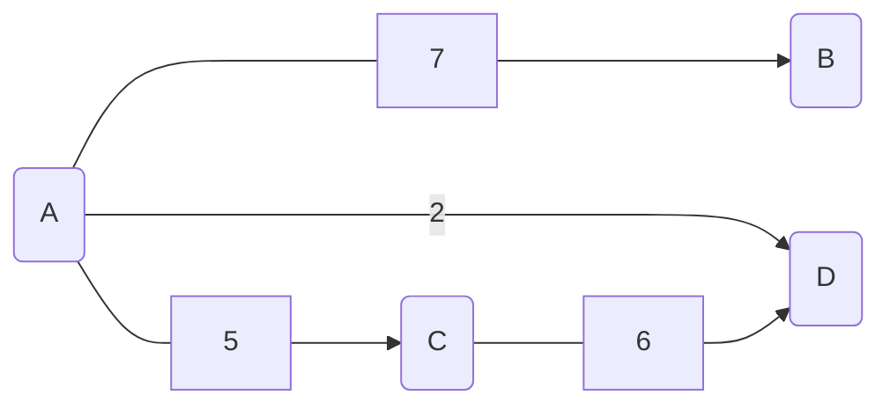
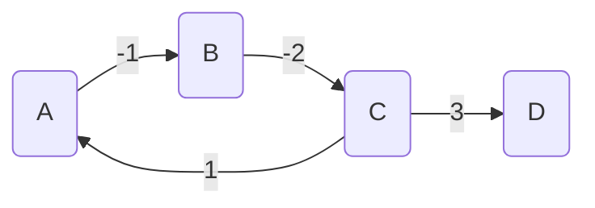
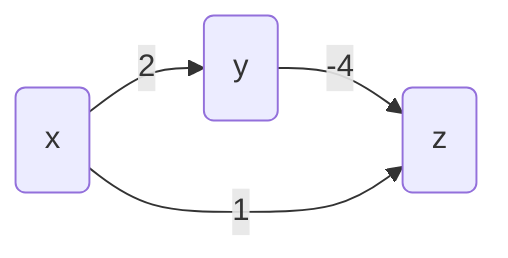
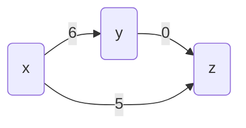

# Plus cours chemin

!!! warning
    Ce cours a été automatiquement traduit des transparents de M.Noyer par Lorentzo et Elowan et mis en forme par Mehdi, nous ne nous accordons en aucun cas son travail, ce site à pour seul but d’être plus compréhensible pendant les périodes de révision que des diaporamas.

## Généralités

### Graphe pondéré

!!!quote "Définition : Graphe pondéré"
    On dit qu'un triplet $G = (V, E, p)$ est un graphe pondéré si le couple $(V,E)$ est un graphe et si $p$ est une fonction de $E$ dans $\mathbb{R}$

On dit que $p$ est la (fonction de) _pondération_. Souvent notée $w$ pour weight.

Si $e \in E$, alors $p(e)$ est le _poids_ de $e$ ou _pondération_ de $e$.

Les graphes sont munis par défaut de la fonction de pondération $p:E \to \mathbb{R}, e \mapsto 1$. Donc tout graphe est un graphe pondéré qui s'ignore.

### Poids d'une chaîne

!!!quote "Définition : Poids d'une chaîne"
    Le _poids_ d'une chaîne (resp. chemin) d'un graphe pondéré non orienté (resp. orienté) est la somme des poids des arêtes(resp. arcs) de la chaîne (resp. chemin).

Si $c$ est la chaîne $x_1, \dots, x_n$ :

$$p(c) = \sum_{i=1}^{n-1} p(\{x_i, x_{i+1}\})$$


_Figure - graphe $ABCD$ avec les poids $7$ $5$ $-2$ et $6$ en mermaid_

$p(ACDA) = -2 +6 +5 = 9$

$p(ADC) = -2+6 = 4 \text{ et } p(AC)=5$

Le _plus court chemin_ de $A$ à $C$ est $ADC$

### Le plus court chemin

Etant donné un graphe pondéré, on recherche le plus court chemin d’un sommet à un autre (ou à tous les autres, ou le plus court chemin entre tous les couples de sommets...)

!!!example ""
    **Exemple :**

    Dans une carte routière de la France, les villes étant des sommets, les routes étant des arcs, chercher le (ou les) trajet(s) de Paris à Marseille qui optimise(nt) l'un des critères suivants :

    - le temps de trajet
    - la distance parcourue
    - le prix des péages

### Recherche de plus courts chemins

Dans tout ce qui suit, les graphes sont considérés comme orientés. Si le graphe $G$ est non orienté, on l'oriente en construisant le graphe orienté tel que :

- $G'$ a les mêmes sommets que $G$
- pour tout arête $\{x, y\}$ de $G$, $G'$ possède les arcs $\{x, y\}$ et $\{y, x\}$

On recherche pour tout couple de sommets $(i, j)$ le plus court chemin de $i$ à $j$ et on calcule sa longueur $d(i, j)$. Si $j$ n'est pas accessible depuis $i$, on note $d(i, j) = +\infty$.

### Longueur de plus courts chemins

#### Cas particuliers des graphes orientés non pondérés

Si le graphe $G$ est orienté et non pondéré, on considère sa pondération par défaut.

Lors du parcours en largeur les sommets sont explorés par distance croissante au sommet source. Grâce à cette propriété on résout le problème de cheminement suivant : calculer les longueurs des plus courts chemins entre un sommet source et tous les sommets du graphe (voir TD).

### Circuits de poids négatif

Pour rechercher un $PCC$( $=$ plus court chemin) dans un graphe, il faut s'assurer au préalable que celui-c ne possède pas de circuit de poids négatif. Cela ne veut pas dire que le graphe ne peut pas contenir d'arcs de poids négatif.



$$p(ABCA) = -2$$

$$p(ABCD) = 0$$

$$p(ABCABCD) = -2$$

$$p(ABCABCABCD) = -4$$

### Sous-chemin du plus court chemin

Si un $PCC$ de $A$ à $C$ passe par $B$, alors le sous-chemin entre $A$ et $B$ est un chemin de poids minimum.

En effet, s’il existe un autre chemin plus court entre $A$ et $B$, il suffit de le mettre à la place du premier pour obtenir un nouveau chemin de $A$ à $C$ encore plus court.

- Ceci contredit le fait que le premier chemin avait un poids minimum.
- Ceci est un cas particulier du principe d’optimalité de Bellman qui dit que l’on peut déduire une solution optimale d’un problème en combinant des solutions optimales d’une série de sous-problèmes.

Pour les $PCC$, on l’utilise en calculant d’abord les $PCC$ passant par un
sous-ensemble de sommets avant de s’attaquer aux $PCC$ passant par
un ensemble de sommets plus gros.

## Algorithme de Floyd-Warshall

### Présentation

L'lagorithme de Floyd-Warshall (parfois appelé algorithme de Roy-Floyd-Warshall car décrit par Bernard Roy en 1959) est un algorithme pour déterminer les distances des plus courts chemins entre toutes les paires de sommets dans un graphe orienté et pondéré, en temps cubique en le nombre de sommets.

Il prend en entrée un graphe orienté et valué, décrit par une matrice d'adjacence donnant le poids d'un arc lorsqu'il existe et la valeur $+\infty$ sinon. Le graphe ne doit pas posséder de circuit de poids strictement négatif.

C'est un exemple de programmation dynamique.

Notons $\{1, 2, \dots, n\}$ l'ensemble des sommets du graphe.
On note aussi $W_{ij}^k$ la valeur de l'arc allant de $i$ à $j$ n'empruntant que des sommets intermédiaires dans $\{1, 2, \dots, k\}$ s'il en existe un, et $+\infty$ sinon.

On note $W^k$ la matrice des $W_{ij}^k$

Pour $k=0$, $W^0$ est la matrice d’adjacence par poids.
Trouvons une relation de récurrence. On considère un chemin $C$ entre $i$ et $j$ de poids minimal dont les sommets intermédiaires sont dans $\{1, 2, \dots, k\}$. De deux choses l’une :

- soit $C$ n’emprunte pas le sommet $k$ ; 
- soit $C$ emprunte exactement une fois le sommet $k$ (car les circuits sont de poids positifs ou nuls) et $C$ est donc la concaténation de deux chemins, $C_{i,k}$ entre $i$ et $k$ et $C_{k,j}$ entre $k$ et $j$ respectivement, dont les sommets intermédiaires sont dans $\{1, 2, \dots, k-1\}$. Par principe de sous-optimalité, si $C$ est optimal, $C_{i,k}$, $C_{k,j}$ aussi.

Cela nous donne la relation de récurrence $\color{red}{W_{i,j}^k = \min(W_{i,j}^{k-1}, W_{i,k}^{k-1} + W_{k,j}^{k-1})}$, pour tous $i, j$ et $k$ dans $\{1, 2, \dots, n\}$. Ainsi on résout les sous-problèmes par valeur de $k$ croissante.

### Pseudo-code

#### 1er

Inconvénients : on crée une matrice à chaque itération. Coûteux en mémoire.

```ocaml linenums="1"
fonction FloydWarshall(G)
    entree: un graphe orienté pondéré G
    sortie: la matrice des plus courts chemins W^n
    W⁰ ⟵ matrice n*n d'adjacence pondérée
    pour k allant de 1 à n faire
        créer une matrice W^k
        pour i allant de 1 à n faire
            pour j allant de 1 à n faire
                W^k_{i,j} ⟵ min(W^{k-1}_{i,j}, W^{k-1}_{i,k} + W^{k-1}{k,j})
        
    renvoyer W^n
```

#### 2nd

Avantage : il n'y a plus qu'une matrice modifiée à chaque itération

Complexité temporelle en $\Theta(n^3)$ (triple boucle toujours parcourue)

Complexité en mémoire de l'ordre du nombre de coefficients, donc $\Theta(n^2)$

```ocaml linenums="1"
fonction FloydWarshall(G)
    entree: un graphe orienté pondéré G
    sortie: la matrice des plus courts chemins W^n
    W <- matrice n*n d'adjacence pondérée
    pour k allant de 1 à n faire
        pour i allant de 1 à n faire
            pour j allant de 1 à n faire
                W_{i,j} ⟵ min(W_{i,j}, W_{i,k} + W_{k,j})
        
    renvoyer W
```

???example "Exemple"
    Graphe :
    ```mermaid
    graph LR
    A(1) -- -2 --> C(3)
    B(2) -- 4 --> A
    B -- 3 --> C
    C -- 2 --> D
    D -- -1 --> B
    ```

    Initialisation :

    $$\begin{pmatrix}
    0 & +\infty & -2 & +\infty \\
    4 & 0 & 3 & +\infty \\
    +\infty & +\infty & 0 & 2 \\
    +\infty & -1 & +\infty & 0
    \end{pmatrix}$$

    Chemins :
    
    $$\begin{pmatrix}
    13 & \\
    21 & 23\\
    34 & \\
    42 & \\
    \end{pmatrix}$$

    Pas de circuit de poids négatif. On ne fera pas mieux que 0 pour aller de x à x.

    **Sommets intermédiaires dans $\{1\}$:**

    $$\begin{pmatrix}
    0 & +\infty & -2 & +\infty \\
    4 & 0 & min(\textbf{3}, \textbf{4}, \textbf{-2}) & +\infty \\
    +\infty & +\infty & 0 & 2 \\
    +\infty & -1 & +\infty & 0
    \end{pmatrix}$$

    Chemins :

    $$\begin{pmatrix}
    13 & \\
    21 & \textbf{213}\\
    34 & \\
    42 & \\
    \end{pmatrix}$$

    **Sommets intermédiaires dans $\{1; 2\}$:**

    $$\begin{pmatrix}
    0 & +\infty & -2 & +\infty \\
    4 & 0 & 2 & +\infty \\
    +\infty & +\infty & 0 & 2 \\
    min(+\infty, \textbf{-1+4}) & -1 & min(+\infty, \textbf{-1+2}) & 0
    \end{pmatrix}$$

    Chemins :

    $$\begin{pmatrix}
    13 & \\
    21 & 213\\
    34 & \\
    42 & \textbf{421} & \textbf{4213} \\
    \end{pmatrix}$$

    **Sommets intermédiaires dans $\{1; 2; 3\}$:**

    $$\begin{pmatrix}
    0 & +\infty & -2 & min(+\infty, \textbf{-2+2}) \\
    4 & 0 & 2 & min(+\infty, \textbf{2+2}) \\
    +\infty & +\infty & 0 & 2 \\
    3 & -1 & 1 & 0\\
    \end{pmatrix}$$

    Chemins : 

    $$\begin{pmatrix}
    13 & \textbf{134} & \\
    21 & 213 & \textbf{2134}\\
    34 & & \\
    42 & 421 & 4213 \\
    \end{pmatrix}$$

    **Sommets intermédiaires dans $\{1; 2; 3; 4\}$:**

    $$\begin{pmatrix}
    0 & min(+\infty, \textbf{0-1}) & -2 & 0 \\
    4 & 0 & 2 & 4 \\
    min(+\infty, \textbf{3+2}) & min(\infty, \textbf{-1+2}) & 0 & 2 \\
    3 & -1 & 1 & 0\\
    \end{pmatrix}$$

    Chemins :
    
    $$\begin{pmatrix}
    13 & 134 & \textbf{1342}\\
    21 & 213 & 2134\\
    34 & \textbf{342} & \textbf{3421} \\
    42 & 421 & 4213 \\
    \end{pmatrix}$$

    k=4 : On s'arrête là

### Floyd-Warshall : Fermeture transitive

Le problème de la _fermeture transitive_ dans un graphe non pondéré $G =(V,E)$ consiste à déterminer si deux sommets $a$ et $b$ peuvent être reliés par un chemin allant de $a$ à $b$.

Pour cela, on utilise la _matrice d'adjacence bouléenne $W$_ dans laquelle $W_{i,j}$ vaut $\textbf{true}$ si il existe un chemin allant de $i$ à $j$ et $\textbf{false}$ sinon.

La relation de récurrence devient :

$$W_{i,j}^k \leftarrow W_{i,j}^{k-1} \lor (W_{i,k}^{k-1} \land W_{k,j}^{k-1})$$

On ne cherche pas la longueur d'un chemin mais seulement s'il en existe un.

!!!note ""
    **Correction de Floyd-Warshall lorsque G ne contient pas de cycle de poids strictement négatif**

    Invariant : $W^k_{i,j}$ est égal au poids d'un chemin minimal reliant $v_i$ à $v_j$ et ne passant que par des sommets intermédiaires de la liste $v_1, \dots, v_k$. 

    Cas de base : Vrai si $k = 0$ car $W^k_{i,j}$ est le poids du chemin minimal qui relie $v_i$ à $v_j$ sans passer par aucun sommet intermédiaire. **OK**

    Si $k < n$, on suppose l’invariant réalisé et on considère $C = v_i \rightsquigarrow v_j$  un $PCC$ ne passant que par les sommets intermédiaire $v_1, \dots, v_{k+1}$. 
    
    - Si $C$ ne passe pas par $v_{k+1}$, alors, par HR, son poids est $W^{k+1}_{i,j} = W^k_{i,j}$. 
    - S’il passe par $v_{k+1}$, alors il n’y passe qu’une fois (pas de circuit de poids négatif). Il se décompose en $C_1 = v_i \rightsquigarrow v_{k+1}$ et $C_2 = v_{k+1} \rightsquigarrow v_j$ qui sont des chemins ne passant que par des sommets dans $v_1, \dots, v_{k}$ . Par principe d’optimalité, ces chemins sont les meilleurs ne passant que par $v_1, \dots, v_{k}, v_{k+1}$. Donc, par **HR**, leurs poids sont $W^k_{i,k+1}$ et $W^k_{k+1,j}$. Le poids de $C$ est donc $W^k_{i,k+1} + W^k_{k+1,j}$.
    - Finalement, $min(w^k_{i,j}, W^k_{i,k+1} + W^k_{j+1,j})$ est le poids minimal d'un chemin reliant $v_i$ à $v_j$ et ne passant que par les sommets intermédiaire $v_1, \dots, v_{k+1}$. 

    Si $k=n$, $W$ contient les longueurs de tous les $PCC$. 

## Algorithme de Dijkstra

### Présentation

Calcule, dans un graphe orienté pondéré par des **réels positifs**, les plus courts chemins à partir d'une source unique en direction de tous les autres sommets.

Dû à l'informaticien néerlandais Edsger Dijkstra (par ailleurs prix Turing), publié en 1959.

Comme les arcs sont de poids positifs, on peut supprimer les boucles : passer par une boucle ne raccourcira jamais un chemin. Dans la suite, nos graphes sont sans boucle.

### Nécessité de la valuation positive

On serait tenté, si un graphe possède des valuations positives,
d’ajouter une même constante à chaque valuation pour les rendre
toutes positives afin d’appliquer l’algorithme de Dijkstra.

Malheureusement cette approche permet certes de trouver les PCC
dans le nouveau graphe mais le chemin suivi peut très bien ne pas
être le meilleur dans l’ancien.

Considérons 

Le $PCC$ de $x$ à $z$ passe par $y$.

Ajoutons 4 à toutes les valuations

Le $PCC$ de $x$ à $z$ passe par l'arc $\{x,z\}$.
### Principe

$G$ a pour ensemble de sommets $[\![ 1, n ]\!]$

On cherche les $PCC$ depuis la _source_ (ou _entrée_) $e$ vers tous les autres sommets.

Principe :

- A chaque tour, on choisit parmi tous les sommets verts celui dont la distance à l'enrée est la plus petite(le plus court chemin). Ce sommet devient rouge.
- Tout voisin bleu du sommet choisi est ajouté à l'ensemble des sommets verts (en ce sens c'est un parcours en largeur). Les informations concernant les distances à la source des voisins du sommet qui vient de devenir rouge sont mises à jour.

C'est un algorithme glouton dont le résultat est optimal. Nous avons vu qu'il existe des algos gloutons non optimaux(par exemple pour la coloration).

L'ensemble des sommets verts est noté $F$ car il est souvent implémenté avec un file de priorité. Graphe $G = (S,A)$

```ocaml linenums="1"
F := {e} /*sommets en cours de traitement (=verts)*/
E := ∅ /*sommets traités = sommets rouges*/
D := tableau des distances minimales (d_e = 0, k ≠ e ⇒ d_k = +∞)
tant que F ≠ ∅ faire
    choisir k ∈ F avec d_k minimal
    F := F \ {k}
    E := E ∪ {k} /*k devient rouge*/
    pour tout voisin v de k non rouge faire
        si v ∉ F /*si v est bleu*/
            F := F ∪ {v} /*v devient vert*/
        fin si
        si d_k + w(k ⟶ v) < d_v
            /*passer par k pour atteindre v est plus rentable*/
            d_v := d_k + w(k ⟶ v) /*maj tab. des distances*/
        fin si
    fin faire
fin faire
```

### Variant

Pour un graphe $G (S, A)$, on note $B=S \setminus (F \cup E)$ l'ensemble des sommets bleus.

- Variant : $|F| + |B|$ (cardinal de l'ensemble de sommets verts ou bleus). Quantité entière positive.
- C'est une quantité décroissante strictement à la fin de chaque tour de boucle car :

    - on retire toujours un sommet de $F$ (si ce n'est pas possible, $F=\emptyset$ et l'algorithme s'arrête).
    - tout sommet ajouté à $F$ est retiré de $B$.
    - ainsi, l'ensemble de  s sommets verts ou bleus comporte un élément de moins à la fin d'un tour par rapport au tour précédent.

!!!example ""
    **Exemple**

    On gère en plus un tableau $P$ (prédécesseur) qui garde en mémoire la dernière étape sur le chemin de la source au sommet considéré.

    <p align="center"></p>

    $$ 
    \begin{array}{c|c|c|c}
    \text{F} & \text{E} & \text{T} & \text{P} \\
    \hline
    \{1\} & \emptyset & [\![0; \infty; \infty; \infty ; \infty ]\!] & [\![ 1,-1,-1,-1,-1]\!] \\
    \{2; 5\} & \{1\} & [\![0; 12; \infty; \infty ; 5 ]\!] & [\![ 1,1,-1,-1,1]\!] \\
    \{2;3;4\} & \{1;5\} & [\![0; 6; 9; 7 ; 5 ]\!] & [\![ 1,5,5,5,1]\!] \\
    \{3;4\} & \{1;5;2\} & [\![0; 6; 8; 7 ; 5 ]\!] & [\![ 1,5,2,5,1]\!] \\
    \{3\} & \{1;5;2;4\} & [\![0; 6; 8; 7 ; 5 ]\!] & [\![ 1,5,2,5,1]\!] \\
    \emptyset & \{1;5;2;4;3\} & [\![0; 6; 8; 7 ; 5 ]\!] & [\![ 1,5,2,5,1]\!] \\
    \end{array}
    $$

    $PCC$ pour aller de 1 à 3 :
    
    - On a $T = [\![0; 6; 8; 7 ; 5 ]\!]$ et $P = [\![ 1,5,2,5,1]\!]$.
    - prédecesseur de $3$ : $P[3] = 2$.
    - prédecesseur de $2$ : $P[2] = 5$.
    - prédecesseur de $5$ : $P[5] = 1$.
    - Donc $1523$ avec un coût de 8.

### Correction

Pour un graphe $G$ d'ensemble de sommets $S$, notons $D$ le tableau des distances et $\delta(e,u)$ la longueur d'un $PCC$ de $e$ à $u$, $w(a, b)$ le poids de l'arc $a \rightarrow b$.

!!!definition ""
    **Théorème**

    A la fin de l'Algorithme de Dijkstra, on a $d_u = \delta(e, u)$ pour tout sommet $u \in S$.

!!!note ""
    **Notations**

    On note $F^k; E^k, d_u^k$ les valeurs de $F, E, d_u$ à la fin de l'itération $k$.

    $F^k$ est l'ensemble des sommets verts à la fin de l'itération $k$, $E^k$ l'ensemble des sommets rouges et $S \setminus (F^k \cup E^k)$ l'ensemble des sommets bleus.

    Un sommet $u$ est bleu à la fin de l'étape $k$ si et seulement si $d_u = +\infty$ si et seulement si $u$ n'est voisin d'aucun sommet rouge à la fin de l'étape $k$.

    Pour tout sommet $u \in S$, $d_u < +\infty$ documente un chemin de $e$ à $u$ n'empruntant que des sommets verts ou rouges.

!!!tip ""
    **Rappel**

    A la fin du parcours, les sommets accessibles depuis $e$ sont dans $E$

Invariant de boucle :

1. Sommets rouges : $\forall u \in E^k, d_u^k = \delta(e, u)$ **(point 1)**
2. Sommet $v$ vert ou bleu différents de $e$ : $d_v^k = min(\{d_u^k + w(u, v) | u \in E^k\})$ ce qui revient par le point 1 à $d_v^k = min(\{\delta(e, u) + w(u, v) | u \in E^k\})$ **(point 2)**

!!!tip ""
    **Remarque**

    La distance $d^k_v$ est donc le poids minimal d'un chemin vert-rouge de $e$ à $v$ dont l'avant dernier sommet est rouge.

    Pour un sommet bleu $v$ à l'étape k, les $w(u, v)$ pour $u$ rouge étant infinis(car $v$ n'est pas voisin d'un rouge), on retrouve que $d_v^k = +\infty$.

**Cas de base :**

- Au tour 0 (avant la boucle) :
    - L'ensemble des sommets rouge est vide, donc pour un sommet $v \neq e$ le minimum des sommes $\delta(u,v) + w(u,v)$ pour les u rouges est infini. Or $d_v^0 = +\infty$ : **Point 2 OK**.
    - Le point 1 est vrai car il n'y a pas de sommet rouge.

- A la fin du 1er tour de boucle $e$ est rouge, $d_e^1 = 0 = \delta(e, e)$ (Point 1 OK) et $d_v^1 = w(e,v)$ pour tout $v \neq e$ donc $d_v^1 = min(\{\delta(e, u) + w(e,v) | u \in E^1\})$ **(Point 2 OK)** puisque seul $e$ est rouge.

**Hérédité (pour le point 1) :**

Soit $u$ un sommet rouge à la fin de l'étape $k+1(k \geq 1)$.

- On a $d_u^{k+1} = d_u^k$ (pas de changement dans le tableau des distances).
- Comme $u$ est rouge, il est accessible, donc $d_u^{k+1}$ est fini, donc le chemin qui le document n'emprunte que des sommets verts ou rouges.
- Si $u \notin E^{k+1}\setminus E^k$, c'est à dire si $u$ n'est pas le sommet qu'on vient de rendre rouge, alors $u in E^k$ et par HR $d_u^k = \delta(e, u)$ **(Point 1 OK)**.
- Si $u$ entre dans $E^{k+1}$ alors au début du passage $k+1$, $u$ est vert ($u \in F^k$) et $d_u^k \leq d_s^k$ pour tout sommet vert $s$ (car $u$ est choisi).
    - Soit $\color{red}{e \rightsquigarrow \textit{u} \text{ un PCC et } \textit{v} \text{ son premier sommet non rouge}}$ ($u=v$ possible). Les sous chemins $e \rightsquigarrow v$ et $v \rightsquigarrow u$ sont des PCC par principe d'optimalité. Comme les poids des arcs sont positifs (condition Dijkstra), il vient que $\color{red}{\delta(e, u) \geq \delta(e, v)}$.
    - $\color{red}{\text{Le prédécesseur } \textit{r} \text{ de } \textit{v} \text{ dans } e \rightsquigarrow v \text{ est rouge et différent de u}}$
    $\color{red}{\text{ donc } d_r^k = \delta(e, r) \text{par HR.}}$
    - $\color{red}{\text{Comme } \textit{v} \text{ n'est pas rouge, il vérifie le point 2}}$ donc 

    $$
    \begin{align}\nonumber
        d_v^k & \space\space\space\space\space\space = \space\space\space\space min(\{\delta(e,x) + w(x,v) | x \in E^k\})\text{ par HR.(2)}\\ \nonumber
        &\underbrace{=}_{e\rightsquigarrow r \rightarrow v \text{ PCC}} \delta(e, r) + w(r, v) = \delta(e,v)\\
    \end{align} \\
    \color{red}\text{Ainsi } d^k_v = \delta(e,v)
    $$

    - $\color{red}{\text{On a } \delta(e,u) \geq \delta(e,v)}$. Et $d^k_v \geq d^k_u$ car $u$ est choisi. Or, $d_u^k$ est le poids d'un chemin de $e$ à $u$ donc plus grand que $\delta(e,u)$ alors

    $$
        \delta(e,u) \geq \delta(e,v) = d^k_v \geq d^k_u \geq \delta(e,u) \textbf{ Point 1 OK}
    $$

**Hérédité (pour le point 2) :**

Soit $v$ un sommet vert ou bleu à la fin de l'étape $k+1$ $\color{red}{\text{non voisin}}$ de l'élément $u$ qui entre dans $E^{k+1}$.

- Alors $d_v^k = d^{k+1}_v$ car $d^k_u + w(u,v) = +\infty$
- On a :
    
    $$
    \begin{align}
        D^{k+1}_v &= d^k_v& \\ \nonumber
        &= min(\{\delta(e, x) + w(x, v) | x \in \underbrace{E^{k+1}}_{E^{k+1}\backslash\{u\}}\})&\\ \nonumber
        &= min(\{\delta(x,k) + w(x, v) | x \in E^k\}\cup\{\underbrace{\delta(e,u)+w(u,v)}_{=+\infty}\}) &\\ \nonumber
        &= min(\{\delta(e,x) + w(x, v) | x \in E^{k+1}\})\color{red}{\text{ : Point 2 OK}} \nonumber
    \end{align}
    $$

Soit $v$ vert ou bleu à la fin de l'étape $k+1$ et $\color{red}{\text{voisin}}$ de l'élément rouge $u$ entrant dans $E^{k+1}$.

- Le sommet $v$ est vert ou bleu à l'étape $k$ mais vert à l'étape $k+1$.

    - $d_v^k = min(\{\delta(e, x) + w(x, v) | x \in E^k\})$ par HR.2
    - $d_v^{k+1} = min(d^k_v, \underbrace{d_u^k}_{=\delta(e,u)\text{ par HR.1}} + w(u,v))$ par algo Dijkstra

- On a donc encore

    $$
        d^{k+1}_v = min(\{\delta(e, x) + w(x, v) | x \in \underbrace{E^{k+1}}_{E^k\cup\{u\}}\}) \textbf{ Point 2 OK }\text{dans ce cas}
    $$

### Complexité pour une source e

#### Force brute pour un graphe de n sommets et p arcs

```ocaml linenums="1"
F := {e}; E := ∅; D := tableau des distances minimales;
tant que F non vide faire
    Choisir k dans F avec d_k minimal /*explorer D en O(n)*/
    F := F\{k}; E := E∪{k}; /*MAJ en O(1) si E,F tableaux*/
    pour tout voisin r de k non rouge faire
        si r ∉ F faire /* cas r bleu*/
            F := F∪{r}; /*O(1)*/
        si d_k + w(k ⟶ r) < d_r faire
            d_r := d_k + w(k ⟶ r); /*maj tableau des distances en O(1)*/
```

Au plus $n$ transferts de $F$ vers $E$ (ligne L4). Pour chacun recherche (ligne L3) du plus petit élément vert dans le tableau des distances : $O(n)$

(L5 à L9) Coût des vérifications et mises à jour pour un sommet $k$ :
$O (deg^{+} k )$. Au total, complexité en multiple de :
$n + \sum_{k = 0}^{n-1} (n + deg^{+} k) = n + n^2 + p = O(n^2)\text{ (Rappel : }p = O(n²))$

#### Avec file de priorité pour un graphe de n sommets et p arcs

Puisqu’on gère un ensemble $F$ des sommets verts et un tableau $D$ des distances à la source, on peut les fusionner en une seule file de priorité $T$ d’éléments $(s ,d (e,s ))$.

On implante les files de priorité comme des tas. On considère donc un tas-min (fils plus grands que père). Création par descente en $O (n)$. On gère en interne $\color{red}{\text{un tableau des positions dans le tas}}$ pour obtenir en $O (1)$ la position d'un sommet dans $T$ en vue d'une MAJ.

```ocaml linenums="1"
E := ∅; /*sommets rouges*/
T := tas-min des couples (sommet, distance depuis e); /*O(n)*/
tant que T ≠ ∅ :
    retirer le sommet (k, d(e,k)) du tas T /*O(ln n)*/
    E := E∪{k};
    pour tout voisin r de k non traité :
        /*nb passages : deg^+ k*/
        si d(e,k)+w(k ⟶ r) < d(e,r): /*O(1)*/
            MAJ T avec d(e,r) := d(e,k)+w(k ⟶ r) /*O(ln n)*/
```

- Complexité de chaque accès/maj dans la file majoré en $O (\log n)$. La file de priorité contient au plus $n$ éléments.
- Par passage dans la boucle `while` : choix puis suppression du sommet $k$ le plus prioritaire : $O(\log n)$. Pour ses $deg^{+} k$ voisins, au plus $deg^{+} k$ maj de clés. Donc coût pour $k$ en $O((1+deg^{+}k)\log n)$. Coût total 

$$ \underbrace{n}_{\text{création du tas}} + \sum_{e=0}^{n-1} (deg^{+} k + 1) \log n = \newline n + n \log n + \log n \sum_{e=0}^{n-1} (deg^{+} k) \leq n \log n + p \log n $$

- Complexité en $O((n + p) \log n)$
- Si $p \log n = O(n^2)$, c'est à dire si $p = O(\frac{n^2}{\log n})$, la complexité avec file de priorités est au moins aussi bonne qu'en force brute.
- Si le graphe est creux (peu d'arêtes), $p=O(n)$, et donc la complexité avec file de priorité est $O(n \log n)$.
- Mais si le graphe est dense (par exemple complet) il y a un nombre d'arc ou d'arêtes en $p=O(n^2)$, et donc la complexité avec file de priorité est $O(n^2 \log n)$. Dans ce cas, l'implémentation par file de priorité n'est pas intéressante.