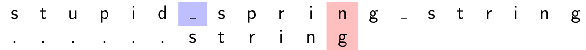

# Recherche dans un texte

!!! warning
    Ce cours a été automatiquement traduit des transparents de M.Noyer par Lorentzo et Elowan et mis en forme par Mehdi, nous ne nous accordons en aucun cas son travail, ce site à pour seul but d'être plus compréhensible pendant les périodes de révision que des diaporamas.

???+ abstract "Sommaire"

    Rappel de l'algorithme naïf  
    Algorithme de Boyer-Moore  

    * Boyer-Moore-Horspool
    
    Algorithme de Rabin-Karp

!!!tip "Crédits"
    Pour Boyer-Moore :

    * [Wikipedia](https://fr.wikipedia.org/wiki/Algorithme_de_Boyer-Moore)
    * Un cours de Marc de Falco
    * Cette [vidéo](https://www.youtube.com/watch?v=4Xyhb72LCX4) de Ben Langmead

    Pour Rabin-Karp : Informatique -Cours et exercices corrigés- (MP2I-MPI) (ellipse)  

## Introduction

### Principe de la recherche

- Soit un texte écrit dans l'alphabet $Σ$
- Soit un autre texte (plus court) écrit dans le même alphabet : le motif  
- On cherche le motif dans le texte et, en cas de présence constatée, on  retourne la position de la première lettre de la première occurence du  motif dans le texte.  
- Nous dirons que _le motif est présent à la position_ $i$ si la lettre $i$ du  texte est égale à la lettre $0$ du motif, la lettre $i+1$ du texte est égale à la lettre $1$ du motif et ainsi de suite jusqu'à la dernière lettre du motif.  

### Différence avec la recherche de sous-tableau dans un  tableau  

- Le nombre de caractères dans l'alphabet est en général négligeable  devant celle du texte exploré  
- Cette propriété amène des optimisations inapplicables dans un  contexte de tableau contenant un grand nombre de symboles  différents.  

## Rappel de l'algorithme naïf

### Conventions

- Soit $s$ le texte et $m$ le motif, $|s|$ et $|m|$ leurs longueurs. Soient $k$, $r$  dans $[\![ 0,\left |\textsf s  \right | ]\!]$. Les lettres sont numérotées à partir de $0$.
- On applique les notation de slicing **Python** :  
  - $s[i]$ est la lettre en position $i$
  - $s[−1]$ : dernière lettre de $s$ (comprendre $s[|s| − 1]$).
  - $s[−k]$ : $k-ième$ lettre de $s$ en partant de la fin (comprendre $s[|s| − k]$).
  - $s[k : r]$ est la sous-chaîne de $s$ qui contient les lettres de la position $k$ à $r−1$. C'est la chaîne vide si $r ≤ k$
  - $s[: r]$ est le préfixe de longueur $r$ de $s$ (lettres $0$ à $r − 1$).
  - $s[: −k]$ est la sous-chaîne qui ne contient pas les $k$ dernières lettres.
 Longueur $|s| − k$.
  - $s[k :]$ est le suffixe de $s$ qui commence à la position $k$ (toutes les lettres  de $s[k]$ incluse à la fin). C'est un mot de longueur $|s| − k$.  

### Principe

- On parcourt toutes les positions de $s[: −(|m| −1)]$ et on fait glisser le  motif de une case à chaque étape (on s'arrête dès que le motif  "dépasse" du texte).
- Pour la position $i$, on regarde si le motif est présent à _partir_ de cette  position :  
  - Pour une position $k$ dans le motif
  - La lettre $s[i + k]$ dans le texte doit être égale à la lettre $m[k]$ dans le  motif
  - Si c'est le cas on passe à la position suivante dans le motif et le texte.
  - Sinon, le motif n'est pas présent en position $i$, on recommence la  recherche à la position $i+1$.  

### Code

``` c linenums="1"
int recherche_naive ( const char *m , const char * s ){  
   int n = strlen ( s ) ; 
   int p = strlen ( m ) ;  
   for ( int i = 0; i <= n - p ; i ++) {  
      int j ;  
      for ( j = 0; j < p ; j ++) {  
         if ( s [ i + j ] != m [ j ]) 
         break ; // pas la peine de continuer  
      } // for j  
      if ( j == p )  
         return i ; // motif en pos . i  
   }  // for i  
   return -1; // motif absent  
}
```

### Complexité au pire

La complexité au pire est obtenue lorsqu'on entre systématiquement dans  la seconde boucle et qu'on explore les lettres du motif presque jusqu'au  bout.

- $s = a^n$ ($n$ lettres) et $m = a^{p-1}b ~~$($p$ lettres)
- On explore les $p$ lettres du motif pour chacune des $n − p + 1$ premières lettres du texte.  
- Complexité au pire en $\Theta((n+1 -p)p)~$ Et $\Theta(np)$ (si $p < \frac{n}{2}$ par exemple).  

### Complexité

- Souvent, au bout d'une ou deux comparaisons, on peut invalider la  position et passer à la suivante.  
- Si le motif est présent à la fin du texte, on a une complexité en  $O(n+p)$ (où $p$ comparaisons sont nécessaires pour vérifier une à une  les lettres du motif).  
- $O(n+p) = O(n)$ si $p ≤ n$.  

## Algorithme de Boyer-Moore

### Boyer-Moore-Horspool

#### Principe de l'algorithme

- On parcourt le texte $s$ du début à la fin mais on effectue parfois un  décalage dépendant de la première comparaison négative (ce qui fait  gagner du temps).  
- Le motif $m$ est recherché en commençant par la fin : on teste la  présence de suffixes du motif de plus en plus gros. $\color{red}\text{C'est le contraire de la méthode naïve ou le motif}$
  $\color{red}\text{est recherché en faisant grossir ses préfixes.}$
- L'algorithme utilise un _pré-traitement_ du motif afin de calculer le _saut maximum_ à effectuer après avoir trouvé une non-concordance.  

- Exploration de la lettre $i$ de $s$ : on se demande si ce n'est pas la  première lettre de $m$.
- On se place donc en position $i + |m| − 1$ de $s$(donc à droite de $i$). On  explore les positions $i + |m| − 1$, $i + |m| − 2$ . . . dans le texte en comparant avec les positions $−1$, $−2$ etc.. du motif. On espère arriver sans encombre à la lettre $i$.
  - Si on arrive sans erreur à la position $i$ : on a trouvé le motif.
  - Sinon, on a trouvé un suffixe $xm'$ de $s[: i+ |m|]$ ($s$ tronqué à $i + |m| − 1$) tel que m'est un suffixe propre de m et pas xm'
    - Si $x$ n'est pas présent dans $m$, on reprend la recherche juste après $x$ (pas la peine de perdre son temps à placer le motif avant le x du texte)
    - si $x$ est présent, on aligne le $x$ de $m$ le plus à droite et le $x$ de $s$

#### Règle du _mauvais caractère_ : exemple

On cherche `string` $(m)$ dans le texte `stupid_spring_string` $(s)$.  

- Démarrage en position $0$ de $s$.  
   
   **d** et **g** ne correspondent pas en position $5$ et il n'y a aucun **d** dans le motif. On passe à la position suivante $0 + |m|$ de $s$.  
- Poursuite en position $6$ de $s$ :  
   
   Le **n** et le **g** ne correspondent pas. Mais $1$ cran à gauche de **g**, il y a  un **n** dans le motif. On aligne donc le **n** du motif avec celui du texte.  

- Poursuite en position $6 + 1$ de $s$ :
   
   Correspondance de $4$ lettres. Mais **p** ne figure pas dans le motif. On décale le motif APRÈS ce **p**, donc de $2$ positions. etc..  

#### Table des sauts/occurences à droite

On veut chercher le motif **abaa**. Voici sa table des occurrences à droite :  
occurrence la plus à droite :

!!!example "Table des occurences à droite"
    $\begin{matrix}
    \text{Lettre} & \text{occurence la plus à droite} & \text{saut max}\\
     & & \\
    a& 2 \text{ (on ne tient pas compte du dernier a)} & 3-2\\
    b& 1 & 3-1\\
    & &  \\
    \text{Autres lettres}& \varnothing  & |m|= 4\\
    \end{matrix}$

On note $d_m(x)$ l'occurrence la plus à droite de $x$ dans $m$.  On veut chercher le motif **abc**. Voici sa table des occurrences à droite :  

!!!example "Table des occurences à droite"
    $\begin{matrix}
    \text{Lettre} & \text{occurence la plus à droite} & \text{saut max}\\
     &  & \\
    a& 0 & 2-0\\
    b& 1 & 2-1\\
     & &  \\
    \text{Autres lettres dont c}& \varnothing  & |m|= 3\\
    \end{matrix}$

!!!quote "Remarques"

    Lorsque la dernière lettre du motif $(m[−1])$ n'est pas présente ailleurs dans $m$ (comme dans **abcd** mais pas **abcb**), le saut pour $m[−1]$ est de $|m|$.  
    Il y a autant de lignes que dans l'alphabet. On peut préférer utiliser  un dictionnaire, ce qui est économe en espace si le motif contient  beaucoup moins de lettres que l'alphabet (songer à l'**UTF16** !)  

#### Définition des variables et principe

$s$ : texte, $m$ : motif, $d_m$ tableau des occurrences les plus à droite.

- $i$ est la position courante dans le texte (position à laquelle on espère  trouver le premier caractère du motif). $i ↑$  
- Le motif est placé sous la position $i$ du texte.
- $j$ est la position de la lettre courante du motif. $j ↓$.  
On compare $s[i + j]$ et $m[j]$ comme dans l'algo naïf.  
- Si $s[i + j] = m[j]$, j est décrémenté : c'est positif pour espérer trouver le motif.
- Si $s [i + j ] ≠ m[j ]$ et $s [i + j ] = y$ , on amène la lettre $y$ la plus à droite du motif (si elle existe...) au dessous de la position $i + j$ du texte.
Ce déplacement peut s'effectuer en décalant le motif vers la gauche
(aucun intérêt) ou vers la droite (très intéressant).

#### Comparaison de $s [i + j]$ avec $m[j]$

$s$ : texte, $m$ : motif, $d_m$ tableau des occurrences les plus à droite.
Le motif a été placé sous la position $i$ du texte. Les lettres $j + 1,j + 2,...,|m|−1$ du motif corespondent bien à leurs homologues du texte.
Supposons que $s[i + j] ≠ m[j]$ (sinon $j$ est décrémenté) :

- Si $d_m(s[i + j]) = ∅$, la recherche du motif ne sera pas satisfaite tant que ce caractère $s[i + j]$ sera présent. On reprend la recherche en $i + j + 1$  
- si $s[i + j]$ est dans le motif et $d_m(s[i + j]) ≥ j$, cela signifie que $s[i + j]$ est présent plus à droite que $j$ dans le motif. Aligner cette occurrence ne permettrait pas d'avancer la recherche (cf figure 1). On reprend en $i + 1$.  
- Si $d_m(s[i + j]) < j$, le caractère $s[i + j]$ est présent dans le motif à gauche de la position courante j. On "aligne" ce caractère du motif avec celui du texte. $\color{red}\text{On reprend donc la recherche dans le texte en}$ $\color{red}i'$ $\color{red}\text{tel que}$ $\color{red}i' + d_m(s[i + j]) = i + j.$ $\color{red}\text{ Ainsi, la nouvelle position dans le texte est }$ $\color{red}i' = i + (j − d_m(s[i + j]))$.  

#### Figure 1 : $d_m(s[i + j]) ≥ j$

$s[i + j]$ est dans le motif et $d_m(s[i + j]) ≥ j$ ($dm(s[i + j])$ est noté $d$) :  

!!!example "Figure 1"
    $\begin{matrix}
    . & . & . & . & . & i & . & . & . & (i+j) &.  & . & . & \text{pos. txt} \\
    &   &   &   &   & a &  &  &  & y &  &  &  & \text{texte}\\
    &  &  &  &  & ? &  &  &  & z & y &  &  & \text{motif}\\
    &  &  &  &  &  &  &  &  & j & d &  &  & \text{pos. motif}
    \end{matrix}$
  
Décaler le motif de $−(d − j)$ n'a pas d'intérêt car le point de départ dans le texte serait alors en $i − d$ qui a déjà été inspecté et invalidé ! On se  place donc en $i + 1$ : aucun gain par rapport à l'algorithme naïf.  

#### Figure 2 : $0 ≤ d_m(s[i + j]) < j$

$d_m$ : table des occurrences à droite. Posons $d = d_m(s[i + j])$.  

!!!example "Figure 2"
    $\begin{matrix}
    \text{. . . .}& i & .& . & . & . & . & . & . &(i+j) & . & . & . &: & \text{ pos. dans txt}\\
    &a& & & & & & & & y & & & &  : & \text{texte} \\
    &?& & & & & y & & & z & & & x &  : & \text{motif m} \\
    &&&&&&<-&-&-&->&&&&&\text{(Aucun y dans m[d+1:])} \\
    &&&&&&&&\text{j - d}& \\
    &0&&&&&d&&&j&&&(|m|-1)& : & \text{pos. dans motif} \\
    \end{matrix}$

Nouveau point de départ en $i + j − d$ (pour aligner les $y$ ) :  

!!!example "Figure 2"
    $\begin{matrix}
    \text{. . . .}& i & . & . & (i+j-d) & . & . & . & . &(i+j) & . & . & . & . & . &: & \text{ pos. dans txt}\\
    & & & & b & & & & & y & & & & & &  : & \text{texte} \\
    \text{dec. = j-d}& & & & ? & & & & & y & u & & z & & x & : & \text{motif good} \\
    \text{dec. < j-d}& & & ? & & & & & y & u & & z & & x & & : & \text{motif bad} \\
    \end{matrix}$

Prendre un décalage $<j-d$ est inutile amène une lettre $u ≠ v$  sous $y$ .  

#### Terminaison Informelle

Dans la boucle externe, $|s| − i$ est strictement décroissant et dans la  boucle interne, c'est $j$ qui est strictement décroissant.  
On en déduit la terminaison  

#### Correction Informelle

Par rapport à l'algo naïf, on fait des sauts.  
Il suffit donc de s'assurer que les positions non explorées du fait des  sauts ne conduisent pas à une solution.  
Un saut de $1$ case n'est pas intéressant à étudier car il correspond à  l'algo naïf.  
On s'intéresse au cas $i = 0$ (pour simplifier) et à un saut de $2$ cases  au moins.  

- Il existe $3$ caractères $x, y , z$ (avec $y ≠ z$) et des mots $m_1, m_2, m_3, s_1, s_2$ (avec $|m| ≥ 1$) tels que $m = m_1  \underbrace{y}_{pos. d_m(y) <y} m_2 \underbrace{z}_{pos. j} m_3x$
et $s = s_1 \underbrace{y}_{pos. 0 +j} m_3 s_2$ et $y ∉ m_2 z m_3$
  
- Un décalage trop faible (donc inférieur à $j − d_m(y ) − 1$) amène une  lettre de $m_2$ au niveau du $y$ de $ym_3s_2$. Or cette lettre de $m_2$ est différente de $y$ (voir transparent figure 2). D'où l'inutilité de décaler moins que $j − d_m(y )$.  

#### Complexité informelle

$s$ texte, $m$ motif  
Si l'alphabet contient beaucoup de caractères (par exemple UTF8),  on peut espérer que les motifs auront peu de répétitions. Chaque décalage sera donc en gros de $|m|$. En cas de recherche infructueuse, on effectue environ $\frac{|s|}{|m|}$ comparaisons.  

Exemple le pire $m = ba^{p−1}$ et $s = a^n$. Il faut, avant de faire un décalage, atteindre le $b$, soit $p$ comparaisons. Et le décalage, obtenu en comparant $a$ et $b$, est alors de $1$ (car $j = 0 < p − 1 = d_a$).  Comme pour l'algo naïf, on a un nombre de comparaisons en  
$Θ((n − p + 1)p) = Θ(|m| × (|s| - |m|)) = O(|m|×|s|)$  

#### Algorithme ♥

_Listing 2 - Table des sauts_

```C linenums="1"
fonction derniereOccurence (m)
    T := une table indexée par les lettres
    /∗prendre plutôt un dictionnaire si gros alphabet ∗/
    pour toute lettre a
        T[a] := −1 /∗ les char sont des entiers ∗/
    pour k = 0 à |m| − 2 /∗ |m| − 2, Si! ∗/
        T[m[k]] := k
    renvoyer  T
```

_Listing 3 - Fonction principale_

```C linenums="1"
fonction rechercher_bmh (m, texte)
    T := derniereOccurence(m)
    i := 0 /∗position dans le texte : ∗/
           /∗on souhaite y trouver le motif ∗/
    tant que i + |m| − 1 < |texte|
        j := |m| − 1 /∗j : position dans le motif ∗/
                     /∗i + j : position courante dans le texte ∗/
        tant que texte [i + j] = m[j] et j >= 0
            j := j −1
        si j < 0
            alors renvoyer i
        d := T[texte[i + j]] /∗pos. la plus à droite dans m ∗/
        si d < 0 /∗texte[i + j] n'est pas dans motif [:−1] ∗/
            alors i := i + j + 1 /∗un cran apres pos. courante ∗/
        sinon 
            si d >= j
                alors i := i + 1 /∗pas mieux que naïf ∗/
            sinon i := i + (j − d) /∗mieux que naïf ∗/ 
    renvoyer −1 /∗not found ∗/
```

### Boyer-Moore complet

L'algorithme de Boyer-Moore complet, plus délicat que Boyer-Moore-Horspool, introduit une seconde table de sauts en plus de la table des dernières occurrences. Conformément au programme, on peut s'abstenir de l'étudier.  

## Algorithme de Rabin-Karp

### Présentation

L'algorithme de Rabin-Karp ou Karp-Rabin est un algorithme de  recherche de sous-chaîne créé par Richard M. Karp et Michael O.Rabin (1987).

Cette méthode recherche un ensemble de motifs donnés (c'est-à-dire des sous-chaînes) dans un texte grâce à une fonction de hachage. On  ne compare donc pas directement le motif à des sous-chaînes du texte  mais seulement leurs empreintes (le hache).

L'algorithme n'est pas beaucoup employé pour les recherches d'une  unique sous-chaîne mais a une importance théorique et s'avère très  efficace pour des recherches de multiples sous-chaînes. (Wikipedia)  

Dans toute la suite on prend $s$ : texte ; $m$ motif. Pour un mot $u$, $u_k$  désigne la lettre $k$ de $u$.  

### Utilisation d'une fonction de hachage

Rappel : $s[i: i+ |m|]$ désigne le _facteur_ de $s$ qui a la même longueur que $m$ et qui commence en position $i$ de $s$.

- On se donne une _fonction de hachage_ $h$ sur les chaînes de caractères  et on calcule une fois pour toute $h(m)$.  

- Pour chaque position $0 ≤ i ≤ |s| − |m|$ on calcule $h(s[i : i + |m|])$.  
- Si $h(m) ≠ h(s[i : i + |m|])$, on est certain que $m$ n'est pas en position $i$ dans le texte.  
- Si $h(m) = h(s[i : i + |m|])$, comme $h$ n'est pas injectif en général, il est possible que $m$ soit en position $i$ dans le texte. Il faut alors comparer $m$ et $s[i : i + |m|]$ en force brute.  

### Choix de h

Le calcul de $h(s[i : i + |m|])$ se fait à priori en $Θ(|m|)$. La séquence  des calculs des haches des sous-chaînes de $s$ a alors la même complexité que la recherche naïve, soit en $Θ((|s| − |m| + 1) × |m|)$ (il  y a $|s| − |m| + 1$ sous-chaînes de $s$ de taille $|m|$).  

D'où l'idée de choisir $h$ de façon à ce que $h(s[i + 1 : i + 1 + |m|])$  s'obtienne à partir de $h(s[i : i + |m|])$ en temps constant.  

Choisissons un entier $B$ arbitraire et posons pour le mot  $u = u_0u_1 ... u_{|m|-1}$ que  

$$h(u) = \sum_{0≤j<|m|}{B^{|m|−1−j} × u_j } $$  
Une telle fonction, polynômiale, se calcule en $O(|m|)$ par la méthode de Horner.
En **C**, un caractère n'est rien d'autre qu'un nombre codé sur un octet d'où la validité du produit.

Selon Wikipedia, cette fonction de hachage est appelée _empreinte de Rabin_.  

Appliquée au texte $s$, et posant $|m| = M$, on obtient :  

$\begin{matrix}
 h(s_is_{i+1} ... s_{i+M})& = & \sum_{j=0}^{M-1}{B^{M−1−j} s_{i+j+1}} \\
 & & & \\
 & = & s_{i+M}B^{M−1−M+1} −s_i B^M +B × \sum_{j=0}^{M-1}{B^{M-1-j}s_{i+j}} \\
 & & & \\
 & = & s_{i+M} + B(h(s_i s_{i+1} ... s_{i+M−1}) − s_i B^{M−1})
\end{matrix}$

On peut donc calculer $h(s[i + 1 : i + 1 + M])$ à partir de $h(s[i : i + M])$  en temps constant : avec un précalcul (une fois pour toute) de $B^{M−1}$, il faut faire une addition une soustraction et $2$ produits.

Il peut y avoir un overflow. D'où la nécessité de travailler modulo (il  est malin de prendre un grand nombre premier pour ce modulo).  

### Cas d'un motif unique

_Listing 4 – Rabin-Karp : recherche d'un motif_

```C linenums="1"
fonction rabin_karp(T, M)
    /* T : texte; M : motif; h : fonction de hachage roulant */
    n : = longueur(T) /* strlen en C */
    m := longueur(M)
    hn := h(T[0 : |M|]) /* hache du debut de mot */
    hm := h(M) /* hache du motif */
    pour i = 0 ... n-m faire
        si hn = hm 
            si T[i : i + |M|] = M
                renvoyer i
        hn := h(T[i + 1 : i + 1 + |M|]) /* O(1) si on ce débrouille bien */
    renvoyer TROP2LALOOSE
```
  
Si on veut toutes les occurrences du motif, on crée une liste initialement vide **positions** puis :  

- On remplace la ligne 10 par : **ajouter $i$ à positions** ;  
- La dernière ligne devient :  **renvoyer positions**  

### Complexité de la recherche de toutes les positions

On pose $N = |s|$ (texte) ; $M = |m|$ (motif)  

- Dans le meilleur cas, les comparaisons des hachés sont toujours négatives et on n'appelle jamais la fonction de comparaison de  chaînes de caractères. Complexité au mieux en $O(N + M)$ ($O(M)$  pour les deux hachés initiaux -souvent $M ≤ N−$). Boyer-Moore  complet (non vu cette année) peut faire encore mieux.  
- Le pire cas arrive quand le motif est présent à toutes les positions.
Avec $s = a^N$ et $m = a^M$ , on doit faire une comparaisons de chaînes  de caractères à chaque position dans le texte.
Complexité en  $O(N(N − M + 1))$ comme pour l'algorithme naïf.

### Cas de motifs multiples

On cherche un ensemble de motifs, tous de longueur **m**

_Listing 5 – Rabin-Karp : recherche de plusieurs motifs_
```C linenums="1"
fontction rabin_karp_ensemble(T, M, m)
    /* T : texte ; M : ensemble de motif; m : lg d'un motif */
    n := longueur(T) /* strlen en C */
    Position := [] /* liste des position trouvees */
    hn := hachhe(T[0 : m]) /* hache du debut du mot */
    pour i = 0 ... n-m faire
        si hn ∈ hm et T[i : i+ 1 + m] ∈ M
            ajouter i a Positions
        hn := hache(T[i : i+ 1 + m])
    renvoyer Positions
```

Pas si efficace pour la recherche d'un motif unique, il faut privilégier Rabin-Karp pour la recherche de plusieurs motifs.  
